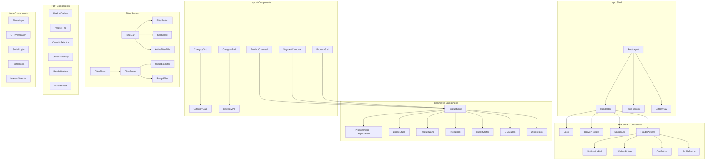
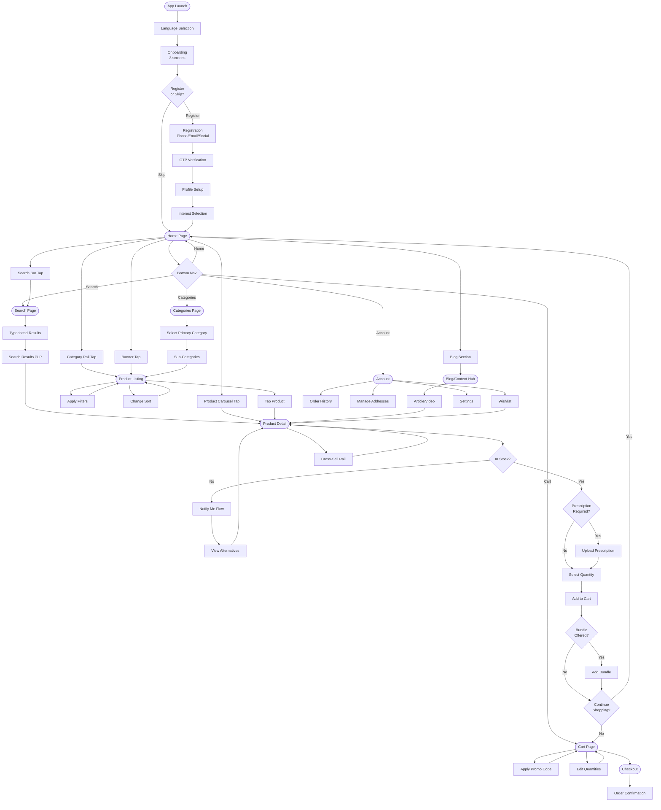
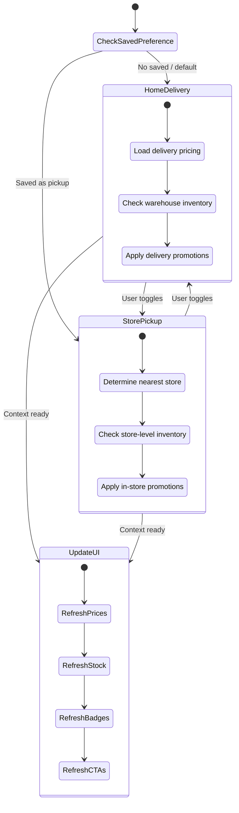
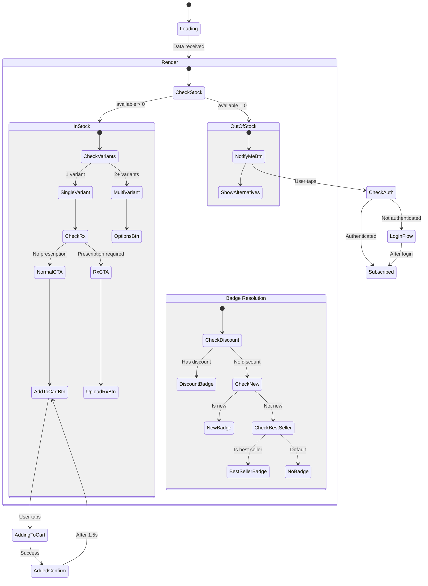

# El Ezaby Pharmacy - Design System Document

> **Date:** 2026-02-24
> **Platform:** Mobile-first PWA (React/Next.js)
> **Stack:** shadcn/ui + TailwindCSS v4 + Radix UI
> **Source:** Derived from El Ezaby Prototype Requirements

---

## Table of Contents

1. [Brand Identity & Design Direction](#1-brand-identity--design-direction)
2. [Design Tokens](#2-design-tokens)
3. [Theme Configuration](#3-theme-configuration)
4. [Component Mapping](#4-component-mapping)
5. [Key Component Designs](#5-key-component-designs)
6. [Page Layouts](#6-page-layouts)
7. [Architecture Diagrams](#7-architecture-diagrams)

---

## 1. Brand Identity & Design Direction

### 1.1 Aesthetic Direction: "Clinical Clarity"

El Ezaby's visual identity sits at the intersection of **pharmaceutical trust** and **modern retail convenience**. The aesthetic is "Clinical Clarity" -- clean surfaces, precise spacing, and a color system rooted in pharmacy green that communicates health, safety, and professionalism without feeling sterile or cold.

**Design Pillars:**
- **Trust-first**: Every visual choice reinforces credibility. No gimmicks, no visual noise.
- **Efficient browsing**: Dense product grids that still breathe. Information hierarchy that lets users scan fast.
- **Warm professionalism**: Pharma green warmed with sandy neutrals. Not hospital-cold, but wellness-warm.
- **Arabic-ready**: Bidirectional layout awareness baked into every component. RTL is not an afterthought.

**What makes this unforgettable:** The signature move is the "prescription label" motif -- thin bordered cards with a distinctive top-edge color accent, evoking pharmaceutical packaging and prescription labels. Every product card, every notification, every modal carries this DNA.

### 1.2 Color Palette

The palette anchors on **El Ezaby green** (the pharmacy's brand color) with a warm neutral system and functional accent colors for commerce states (discounts, alerts, stock status).

#### Primary Colors

| Token | Role | OKLCH Value | Hex Approx |
|-------|------|-------------|------------|
| `--primary` | Brand green, CTAs, active states | `oklch(0.55 0.15 155)` | `#1a8a4a` |
| `--primary-light` | Hover states, light fills | `oklch(0.70 0.12 155)` | `#3cb371` |
| `--primary-dark` | Pressed states, text on light | `oklch(0.40 0.12 155)` | `#0d6b3a` |
| `--primary-surface` | Tinted backgrounds | `oklch(0.97 0.03 155)` | `#eef8f0` |

#### Neutral Colors

| Token | Role | OKLCH Value | Hex Approx |
|-------|------|-------------|------------|
| `--neutral-50` | Page background | `oklch(0.985 0.005 90)` | `#faf9f7` |
| `--neutral-100` | Card backgrounds | `oklch(0.97 0.005 90)` | `#f5f3f0` |
| `--neutral-200` | Borders, dividers | `oklch(0.91 0.008 90)` | `#e5e1db` |
| `--neutral-300` | Disabled states | `oklch(0.82 0.008 90)` | `#ccc7bf` |
| `--neutral-400` | Placeholder text | `oklch(0.70 0.008 90)` | `#a09a91` |
| `--neutral-500` | Secondary text | `oklch(0.58 0.008 90)` | `#7d776e` |
| `--neutral-600` | Body text | `oklch(0.45 0.010 90)` | `#5c564e` |
| `--neutral-700` | Headings | `oklch(0.35 0.012 85)` | `#413c35` |
| `--neutral-800` | High-emphasis text | `oklch(0.25 0.012 85)` | `#2a2621` |
| `--neutral-900` | Maximum contrast | `oklch(0.15 0.010 85)` | `#171410` |

#### Accent / Functional Colors

| Token | Role | OKLCH Value | Hex Approx |
|-------|------|-------------|------------|
| `--accent-red` | Discount badges, errors | `oklch(0.55 0.22 25)` | `#d63031` |
| `--accent-red-surface` | Error background | `oklch(0.95 0.04 25)` | `#fef0f0` |
| `--accent-amber` | Warnings, low stock | `oklch(0.75 0.16 80)` | `#e8a317` |
| `--accent-amber-surface` | Warning background | `oklch(0.96 0.04 80)` | `#fef9ec` |
| `--accent-blue` | Info, links, insurance | `oklch(0.55 0.15 250)` | `#2e86de` |
| `--accent-blue-surface` | Info background | `oklch(0.96 0.03 250)` | `#eff5fc` |
| `--accent-teal` | Prescription, health | `oklch(0.60 0.12 195)` | `#00b894` |

### 1.3 Typography System

**Font Selection Rationale:** Pharmacy interfaces need to balance authority with approachability. We avoid the overused Inter/Roboto defaults and instead pair two fonts with distinct character.

#### Font Stack

| Role | Font Family | Weight Range | Fallback |
|------|------------|-------------|----------|
| **Display / Headings** | **DM Serif Display** | 400 | Georgia, serif |
| **Body / UI** | **Plus Jakarta Sans** | 400, 500, 600, 700 | system-ui, sans-serif |
| **Mono / Data** | **JetBrains Mono** | 400, 500 | monospace |
| **Arabic Display** | **Noto Naskh Arabic** | 400, 700 | serif |
| **Arabic Body** | **IBM Plex Sans Arabic** | 400, 500, 600, 700 | sans-serif |

**Why these fonts:**
- **DM Serif Display**: A refined transitional serif with pharmaceutical gravitas. Used sparingly for page titles, hero text, and price displays. Its sharp serifs echo the precision of pharmaceutical labeling.
- **Plus Jakarta Sans**: A geometric sans-serif with soft, rounded terminals that add warmth. Excellent legibility at small sizes (critical for product names in grids). Distinctive enough to avoid the "template" look.
- **JetBrains Mono**: Used for SKU numbers, prices, and data-heavy contexts. Monospaced for alignment in price columns.

#### Type Scale

```
--text-2xs:   0.625rem / 10px  (badges, fine print)
--text-xs:    0.75rem  / 12px  (captions, metadata)
--text-sm:    0.875rem / 14px  (body small, product names in grid)
--text-base:  1rem     / 16px  (body, UI elements)
--text-lg:    1.125rem / 18px  (section headings)
--text-xl:    1.25rem  / 20px  (page sub-headings)
--text-2xl:   1.5rem   / 24px  (page headings)
--text-3xl:   1.875rem / 30px  (hero text, price display)
--text-4xl:   2.25rem  / 36px  (marketing hero only)
```

#### Line Heights

```
--leading-none:    1
--leading-tight:   1.25
--leading-snug:    1.375
--leading-normal:  1.5
--leading-relaxed: 1.625
```

### 1.4 Spacing Scale

Three-tier spacing system: **Micro** (within components), **Macro** (between components), **Layout** (page-level).

```
MICRO (component internals):
--space-0.5:  0.125rem /  2px
--space-1:    0.25rem  /  4px
--space-1.5:  0.375rem /  6px
--space-2:    0.5rem   /  8px
--space-3:    0.75rem  / 12px
--space-4:    1rem     / 16px

MACRO (between components):
--space-5:    1.25rem  / 20px
--space-6:    1.5rem   / 24px
--space-8:    2rem     / 32px
--space-10:   2.5rem   / 40px

LAYOUT (page sections):
--space-12:   3rem     / 48px
--space-16:   4rem     / 64px
--space-20:   5rem     / 80px
--space-24:   6rem     / 96px
```

### 1.5 Border Radius

```
--radius-none: 0
--radius-sm:   0.25rem  /  4px  (badges, small elements)
--radius-md:   0.5rem   /  8px  (buttons, inputs)
--radius-lg:   0.75rem  / 12px  (cards, modals)
--radius-xl:   1rem     / 16px  (large cards, sheets)
--radius-2xl:  1.5rem   / 24px  (category pills)
--radius-full: 9999px             (avatars, circular buttons)
```

### 1.6 Elevation / Shadow System

```
--shadow-xs:   0 1px 2px oklch(0.15 0.01 85 / 0.05)
--shadow-sm:   0 1px 3px oklch(0.15 0.01 85 / 0.08), 0 1px 2px oklch(0.15 0.01 85 / 0.04)
--shadow-md:   0 4px 6px oklch(0.15 0.01 85 / 0.06), 0 2px 4px oklch(0.15 0.01 85 / 0.04)
--shadow-lg:   0 10px 15px oklch(0.15 0.01 85 / 0.08), 0 4px 6px oklch(0.15 0.01 85 / 0.04)
--shadow-xl:   0 20px 25px oklch(0.15 0.01 85 / 0.10), 0 8px 10px oklch(0.15 0.01 85 / 0.04)
--shadow-card: 0 1px 3px oklch(0.15 0.01 85 / 0.06), 0 0 0 1px oklch(0.15 0.01 85 / 0.03)
```

---

## 2. Design Tokens

### 2.1 Three-Tier Token Architecture

```
TIER 1: Primitive Tokens (raw values)
  oklch(0.55 0.15 155) = a specific green

TIER 2: Semantic Tokens (purpose-mapped)
  --color-brand-primary = oklch(0.55 0.15 155)
  --color-text-primary  = oklch(0.25 0.012 85)

TIER 3: Component Tokens (scoped to components)
  --button-bg           = var(--color-brand-primary)
  --card-border         = var(--color-border-default)
```

### 2.2 Semantic Token Map

```css
/* Surfaces */
--color-surface-page:       var(--neutral-50);
--color-surface-card:       white;
--color-surface-elevated:   white;
--color-surface-overlay:    oklch(0.15 0.01 85 / 0.5);
--color-surface-sunken:     var(--neutral-100);

/* Text */
--color-text-primary:       var(--neutral-800);
--color-text-secondary:     var(--neutral-500);
--color-text-tertiary:      var(--neutral-400);
--color-text-inverse:       white;
--color-text-brand:         var(--primary);
--color-text-discount:      var(--accent-red);
--color-text-link:          var(--accent-blue);

/* Borders */
--color-border-default:     var(--neutral-200);
--color-border-strong:      var(--neutral-300);
--color-border-brand:       var(--primary);
--color-border-error:       var(--accent-red);

/* Interactive */
--color-interactive-primary:       var(--primary);
--color-interactive-primary-hover: var(--primary-light);
--color-interactive-primary-press: var(--primary-dark);
--color-interactive-disabled:      var(--neutral-300);
```

---

## 3. Theme Configuration

### 3.1 globals.css

```css
@import url('https://fonts.googleapis.com/css2?family=DM+Serif+Display&family=Plus+Jakarta+Sans:wght@400;500;600;700&family=JetBrains+Mono:wght@400;500&family=IBM+Plex+Sans+Arabic:wght@400;500;600;700&family=Noto+Naskh+Arabic:wght@400;700&display=swap');

@tailwind base;
@tailwind components;
@tailwind utilities;

@layer base {
  :root {
    /* ===== PRIMITIVE TOKENS (Tier 1) ===== */
    --green-50:  oklch(0.97 0.03 155);
    --green-100: oklch(0.93 0.06 155);
    --green-200: oklch(0.85 0.09 155);
    --green-300: oklch(0.75 0.12 155);
    --green-400: oklch(0.65 0.14 155);
    --green-500: oklch(0.55 0.15 155);
    --green-600: oklch(0.48 0.14 155);
    --green-700: oklch(0.40 0.12 155);
    --green-800: oklch(0.32 0.10 155);
    --green-900: oklch(0.24 0.08 155);

    --sand-50:   oklch(0.985 0.005 90);
    --sand-100:  oklch(0.97 0.005 90);
    --sand-200:  oklch(0.91 0.008 90);
    --sand-300:  oklch(0.82 0.008 90);
    --sand-400:  oklch(0.70 0.008 90);
    --sand-500:  oklch(0.58 0.008 90);
    --sand-600:  oklch(0.45 0.010 90);
    --sand-700:  oklch(0.35 0.012 85);
    --sand-800:  oklch(0.25 0.012 85);
    --sand-900:  oklch(0.15 0.010 85);

    --red-500:   oklch(0.55 0.22 25);
    --red-50:    oklch(0.95 0.04 25);
    --amber-500: oklch(0.75 0.16 80);
    --amber-50:  oklch(0.96 0.04 80);
    --blue-500:  oklch(0.55 0.15 250);
    --blue-50:   oklch(0.96 0.03 250);
    --teal-500:  oklch(0.60 0.12 195);

    /* ===== SEMANTIC TOKENS (Tier 2) ===== */

    /* shadcn/ui required variables */
    --background: var(--sand-50);
    --foreground: var(--sand-800);

    --card: 0 0% 100%;
    --card-foreground: var(--sand-800);

    --popover: 0 0% 100%;
    --popover-foreground: var(--sand-800);

    --primary: var(--green-500);
    --primary-foreground: oklch(1 0 0);

    --secondary: var(--sand-100);
    --secondary-foreground: var(--sand-700);

    --muted: var(--sand-100);
    --muted-foreground: var(--sand-500);

    --accent: var(--green-50);
    --accent-foreground: var(--green-700);

    --destructive: var(--red-500);
    --destructive-foreground: oklch(1 0 0);

    --border: var(--sand-200);
    --input: var(--sand-200);
    --ring: var(--green-400);

    /* Custom semantic tokens */
    --color-discount: var(--red-500);
    --color-discount-bg: var(--red-50);
    --color-warning: var(--amber-500);
    --color-warning-bg: var(--amber-50);
    --color-info: var(--blue-500);
    --color-info-bg: var(--blue-50);
    --color-health: var(--teal-500);
    --color-success: var(--green-500);
    --color-success-bg: var(--green-50);

    /* Prescription label accent (signature motif) */
    --color-card-accent: var(--green-500);
    --color-card-accent-rx: var(--teal-500);
    --color-card-accent-sale: var(--red-500);

    /* Shadows */
    --shadow-card: 0 1px 3px oklch(0.15 0.01 85 / 0.06),
                   0 0 0 1px oklch(0.15 0.01 85 / 0.03);
    --shadow-elevated: 0 4px 6px oklch(0.15 0.01 85 / 0.06),
                       0 2px 4px oklch(0.15 0.01 85 / 0.04);
    --shadow-sheet: 0 -4px 20px oklch(0.15 0.01 85 / 0.12);
    --shadow-bottom-nav: 0 -1px 3px oklch(0.15 0.01 85 / 0.08);

    /* Radii */
    --radius: 0.5rem;
    --radius-sm: 0.25rem;
    --radius-lg: 0.75rem;
    --radius-xl: 1rem;
    --radius-2xl: 1.5rem;
    --radius-pill: 9999px;

    /* Motion */
    --ease-out-expo: cubic-bezier(0.16, 1, 0.3, 1);
    --ease-in-out: cubic-bezier(0.4, 0, 0.2, 1);
    --duration-fast: 150ms;
    --duration-normal: 250ms;
    --duration-slow: 400ms;

    /* Z-index scale */
    --z-base: 0;
    --z-dropdown: 50;
    --z-sticky: 100;
    --z-overlay: 200;
    --z-modal: 300;
    --z-toast: 400;
    --z-max: 999;

    /* Layout */
    --header-height: 7rem;
    --header-collapsed-height: 3.5rem;
    --bottom-nav-height: 4rem;
    --page-padding-x: 1rem;
    --safe-area-bottom: env(safe-area-inset-bottom, 0px);
  }

  .dark {
    --background: oklch(0.14 0.008 85);
    --foreground: oklch(0.93 0.005 90);

    --card: oklch(0.18 0.008 85);
    --card-foreground: oklch(0.93 0.005 90);

    --popover: oklch(0.18 0.008 85);
    --popover-foreground: oklch(0.93 0.005 90);

    --primary: oklch(0.65 0.14 155);
    --primary-foreground: oklch(0.14 0.008 85);

    --secondary: oklch(0.22 0.008 85);
    --secondary-foreground: oklch(0.88 0.005 90);

    --muted: oklch(0.22 0.008 85);
    --muted-foreground: oklch(0.62 0.008 90);

    --accent: oklch(0.22 0.04 155);
    --accent-foreground: oklch(0.85 0.09 155);

    --destructive: oklch(0.60 0.20 25);
    --destructive-foreground: oklch(0.14 0.008 85);

    --border: oklch(0.28 0.008 85);
    --input: oklch(0.28 0.008 85);
    --ring: oklch(0.55 0.15 155);

    --color-discount: oklch(0.65 0.20 25);
    --color-warning: oklch(0.80 0.14 80);
    --color-info: oklch(0.65 0.13 250);

    --shadow-card: 0 1px 3px oklch(0 0 0 / 0.3),
                   0 0 0 1px oklch(1 0 0 / 0.03);
    --shadow-elevated: 0 4px 6px oklch(0 0 0 / 0.4);
    --shadow-sheet: 0 -4px 20px oklch(0 0 0 / 0.5);
    --shadow-bottom-nav: 0 -1px 3px oklch(0 0 0 / 0.3);
  }

  /* RTL support */
  [dir="rtl"] {
    --page-flow: rtl;
    font-family: 'IBM Plex Sans Arabic', 'Plus Jakarta Sans', system-ui, sans-serif;
  }

  [dir="rtl"] h1,
  [dir="rtl"] h2,
  [dir="rtl"] h3 {
    font-family: 'Noto Naskh Arabic', 'DM Serif Display', Georgia, serif;
  }
}

@layer base {
  * {
    @apply border-border;
  }

  body {
    @apply bg-background text-foreground;
    font-family: 'Plus Jakarta Sans', system-ui, sans-serif;
    -webkit-font-smoothing: antialiased;
    -moz-osx-font-smoothing: grayscale;
  }

  h1, h2, h3 {
    font-family: 'DM Serif Display', Georgia, serif;
  }

  /* Safe area for bottom nav */
  .pb-safe {
    padding-bottom: calc(var(--bottom-nav-height) + var(--safe-area-bottom));
  }
}

@layer utilities {
  /* Prescription label top-accent on cards */
  .card-accent {
    position: relative;
  }
  .card-accent::before {
    content: '';
    position: absolute;
    top: 0;
    left: 0;
    right: 0;
    height: 3px;
    background: var(--color-card-accent);
    border-radius: var(--radius-lg) var(--radius-lg) 0 0;
  }
  .card-accent-sale::before {
    background: var(--color-card-accent-sale);
  }
  .card-accent-rx::before {
    background: var(--color-card-accent-rx);
  }

  /* Hide scrollbar for horizontal scroll rails */
  .scrollbar-hide {
    -ms-overflow-style: none;
    scrollbar-width: none;
  }
  .scrollbar-hide::-webkit-scrollbar {
    display: none;
  }

  /* Line clamp utilities */
  .line-clamp-2 {
    display: -webkit-box;
    -webkit-line-clamp: 2;
    -webkit-box-orient: vertical;
    overflow: hidden;
  }

  /* Stagger animation delays */
  .stagger-1 { animation-delay: 50ms; }
  .stagger-2 { animation-delay: 100ms; }
  .stagger-3 { animation-delay: 150ms; }
  .stagger-4 { animation-delay: 200ms; }
  .stagger-5 { animation-delay: 250ms; }
  .stagger-6 { animation-delay: 300ms; }
}
```

### 3.2 tailwind.config.ts

```typescript
import type { Config } from "tailwindcss";

const config: Config = {
  darkMode: ["class"],
  content: [
    "./pages/**/*.{ts,tsx}",
    "./components/**/*.{ts,tsx}",
    "./app/**/*.{ts,tsx}",
    "./src/**/*.{ts,tsx}",
  ],
  theme: {
    extend: {
      fontFamily: {
        display: ['"DM Serif Display"', "Georgia", "serif"],
        sans: ['"Plus Jakarta Sans"', "system-ui", "sans-serif"],
        mono: ['"JetBrains Mono"', "monospace"],
        "arabic-display": ['"Noto Naskh Arabic"', "serif"],
        "arabic-body": ['"IBM Plex Sans Arabic"', "sans-serif"],
      },
      colors: {
        brand: {
          50: "var(--green-50)",
          100: "var(--green-100)",
          200: "var(--green-200)",
          300: "var(--green-300)",
          400: "var(--green-400)",
          500: "var(--green-500)",
          600: "var(--green-600)",
          700: "var(--green-700)",
          800: "var(--green-800)",
          900: "var(--green-900)",
        },
        sand: {
          50: "var(--sand-50)",
          100: "var(--sand-100)",
          200: "var(--sand-200)",
          300: "var(--sand-300)",
          400: "var(--sand-400)",
          500: "var(--sand-500)",
          600: "var(--sand-600)",
          700: "var(--sand-700)",
          800: "var(--sand-800)",
          900: "var(--sand-900)",
        },
        discount: "var(--color-discount)",
        warning: "var(--color-warning)",
        info: "var(--color-info)",
        health: "var(--color-health)",
      },
      borderRadius: {
        sm: "var(--radius-sm)",
        DEFAULT: "var(--radius)",
        lg: "var(--radius-lg)",
        xl: "var(--radius-xl)",
        "2xl": "var(--radius-2xl)",
        pill: "var(--radius-pill)",
      },
      boxShadow: {
        card: "var(--shadow-card)",
        elevated: "var(--shadow-elevated)",
        sheet: "var(--shadow-sheet)",
        "bottom-nav": "var(--shadow-bottom-nav)",
      },
      spacing: {
        "header": "var(--header-height)",
        "header-collapsed": "var(--header-collapsed-height)",
        "bottom-nav": "var(--bottom-nav-height)",
        "page-x": "var(--page-padding-x)",
        "safe-bottom": "var(--safe-area-bottom)",
      },
      zIndex: {
        dropdown: "50",
        sticky: "100",
        overlay: "200",
        modal: "300",
        toast: "400",
        max: "999",
      },
      fontSize: {
        "2xs": ["0.625rem", { lineHeight: "1" }],
      },
      keyframes: {
        "slide-up": {
          from: { transform: "translateY(100%)" },
          to: { transform: "translateY(0)" },
        },
        "slide-down": {
          from: { transform: "translateY(-100%)" },
          to: { transform: "translateY(0)" },
        },
        "fade-in": {
          from: { opacity: "0" },
          to: { opacity: "1" },
        },
        "scale-in": {
          from: { opacity: "0", transform: "scale(0.95)" },
          to: { opacity: "1", transform: "scale(1)" },
        },
        "cart-bounce": {
          "0%, 100%": { transform: "scale(1)" },
          "50%": { transform: "scale(1.15)" },
        },
        "pulse-stock": {
          "0%, 100%": { opacity: "1" },
          "50%": { opacity: "0.5" },
        },
        "shimmer": {
          "0%": { backgroundPosition: "-200% 0" },
          "100%": { backgroundPosition: "200% 0" },
        },
      },
      animation: {
        "slide-up": "slide-up 0.4s var(--ease-out-expo)",
        "slide-down": "slide-down 0.3s var(--ease-out-expo)",
        "fade-in": "fade-in 0.25s var(--ease-in-out)",
        "scale-in": "scale-in 0.25s var(--ease-out-expo)",
        "cart-bounce": "cart-bounce 0.3s var(--ease-out-expo)",
        "pulse-stock": "pulse-stock 2s ease-in-out infinite",
        "shimmer": "shimmer 1.5s ease-in-out infinite",
      },
    },
  },
  plugins: [require("tailwindcss-animate")],
};

export default config;
```

### 3.3 shadcn/ui Component Overrides

Override the default shadcn theme by customizing component styles in each component file. Key overrides:

**Button** -- Rounder, with distinct pharmacy states:
```typescript
// components/ui/button.tsx - variant additions
const buttonVariants = cva(
  "inline-flex items-center justify-center whitespace-nowrap rounded-md text-sm font-semibold ring-offset-background transition-all duration-200 focus-visible:outline-none focus-visible:ring-2 focus-visible:ring-ring focus-visible:ring-offset-2 disabled:pointer-events-none disabled:opacity-50 active:scale-[0.98]",
  {
    variants: {
      variant: {
        default: "bg-primary text-primary-foreground hover:bg-brand-400 shadow-sm",
        destructive: "bg-destructive text-destructive-foreground hover:bg-destructive/90",
        outline: "border border-input bg-background hover:bg-accent hover:text-accent-foreground",
        secondary: "bg-secondary text-secondary-foreground hover:bg-sand-200",
        ghost: "hover:bg-accent hover:text-accent-foreground",
        link: "text-brand-500 underline-offset-4 hover:underline",
        // Custom El Ezaby variants
        "add-to-cart": "bg-primary text-primary-foreground hover:bg-brand-400 shadow-sm font-bold",
        "notify-me": "bg-sand-800 text-white hover:bg-sand-700 shadow-sm",
        "options": "border-2 border-primary text-primary bg-white hover:bg-brand-50",
        "upload-rx": "bg-health text-white hover:opacity-90 shadow-sm",
      },
      size: {
        default: "h-10 px-4 py-2",
        sm: "h-9 rounded-md px-3",
        lg: "h-11 rounded-md px-8",
        icon: "h-10 w-10",
        // Product card CTA
        "card-cta": "h-9 w-full rounded-lg text-sm",
        // Full-width PDP CTA
        "pdp-cta": "h-12 w-full rounded-xl text-base",
      },
    },
    defaultVariants: {
      variant: "default",
      size: "default",
    },
  }
);
```

**Card** -- Prescription label motif with top accent:
```typescript
// components/ui/card.tsx - add accent prop
interface CardProps extends React.HTMLAttributes<HTMLDivElement> {
  accent?: "brand" | "sale" | "rx" | "none";
}

const Card = React.forwardRef<HTMLDivElement, CardProps>(
  ({ className, accent = "none", ...props }, ref) => (
    <div
      ref={ref}
      className={cn(
        "rounded-lg bg-card text-card-foreground shadow-card",
        accent === "brand" && "card-accent",
        accent === "sale" && "card-accent card-accent-sale",
        accent === "rx" && "card-accent card-accent-rx",
        className
      )}
      {...props}
    />
  )
);
```

**Badge** -- Pharmacy-specific badge variants:
```typescript
// components/ui/badge.tsx - additional variants
const badgeVariants = cva(
  "inline-flex items-center rounded-sm border px-2 py-0.5 text-2xs font-semibold transition-colors",
  {
    variants: {
      variant: {
        default: "border-transparent bg-primary text-primary-foreground",
        secondary: "border-transparent bg-secondary text-secondary-foreground",
        destructive: "border-transparent bg-destructive text-destructive-foreground",
        outline: "text-foreground",
        // Custom variants
        discount: "border-transparent bg-discount text-white rounded-sm",
        "low-stock": "border-transparent bg-warning text-sand-900 rounded-sm",
        prescription: "border-transparent bg-health text-white rounded-sm",
        "new": "border-transparent bg-brand-100 text-brand-700 rounded-sm",
        "best-seller": "border-transparent bg-amber-50 text-amber-900 rounded-sm",
        "oos": "border-transparent bg-sand-200 text-sand-600 rounded-sm",
      },
    },
    defaultVariants: {
      variant: "default",
    },
  }
);
```

---

## 4. Component Mapping

### 4.1 Page-to-Component Matrix

Each page in the El Ezaby platform maps to specific shadcn/ui primitives combined with custom wrappers.

#### Home Page

| Feature | shadcn Components | Custom Wrapper |
|---------|------------------|----------------|
| Header (expanded/collapsed) | -- | `<HeaderBar />` |
| Delivery toggle | `Switch`, `ToggleGroup` | `<DeliveryToggle />` |
| Search bar | `Input`, `Command` | `<SearchBar />` |
| Notification bell | `Button` (icon), `Badge` | `<NotificationBell />` |
| Quick-access icons | `Button` (icon) | `<HeaderActions />` |
| Category rail | `ScrollArea`, `AspectRatio` | `<CategoryRail />` |
| Section renderer | -- | `<SectionRenderer />` |
| Multi-segment carousel | `Carousel`, `Tabs`, `Card` | `<SegmentCarousel />` |
| Product carousel | `Carousel`, `Card` | `<ProductCarousel />` |
| Video component | `AspectRatio`, `Dialog` | `<VideoPlayer />` |
| Blog preview | `Card`, `Badge`, `AspectRatio` | `<BlogCard />` |
| Bottom navigation | -- | `<BottomNav />` |

#### Categories Page

| Feature | shadcn Components | Custom Wrapper |
|---------|------------------|----------------|
| Primary category tabs | `Tabs`, `TabsList`, `TabsTrigger` | `<CategoryTabs />` |
| Sub-category banners | `Carousel`, `AspectRatio` | `<SubCategoryBanner />` |
| Deep category grid | `Card`, `AspectRatio`, `Badge` | `<CategoryGrid />` |
| Category hierarchy | `Accordion`, `AccordionItem` | `<CategoryAccordion />` |

#### Product Listing Page (PLP)

| Feature | shadcn Components | Custom Wrapper |
|---------|------------------|----------------|
| Page banner | `AspectRatio`, `Skeleton` | `<PLPBanner />` |
| Filter bar | `Button`, `Badge`, `Sheet` | `<FilterBar />` |
| Sort selector | `Select`, `SelectContent` | `<SortSelect />` |
| Filter sheet (mobile) | `Sheet`, `SheetContent`, `Checkbox`, `Accordion`, `Slider` | `<FilterSheet />` |
| Product grid | -- | `<ProductGrid />` |
| Product card (item) | `Card`, `Badge`, `Button`, `AspectRatio` | `<ProductCard />` |
| Infinite scroll | `Skeleton` | `<InfiniteScroll />` |
| Empty state | `Card` | `<EmptyState />` |

#### Product Detail Page (PDP)

| Feature | shadcn Components | Custom Wrapper |
|---------|------------------|----------------|
| Image gallery | `Carousel`, `CarouselContent`, `AspectRatio`, `Dialog` | `<ProductGallery />` |
| Breadcrumb | `Breadcrumb` | -- |
| Title & brand | -- | `<ProductTitle />` |
| Price block | `Badge` | `<PriceBlock />` |
| Quantity selector | `Button`, `Input` | `<QuantitySelector />` |
| Primary CTA | `Button` | `<CTAButton />` |
| Store availability | `Input`, `Button`, `Card` | `<StoreAvailability />` |
| Description | `Accordion`, `AccordionItem` | `<ProductDescription />` |
| Bundle section | `Card`, `Checkbox`, `Badge` | `<BundleSection />` |
| Specs accordion | `Accordion`, `AccordionItem` | -- |
| Cross-sell rail | `Carousel`, `Card` | `<ProductCarousel />` |
| Variant selector | `Sheet`, `RadioGroup`, `RadioGroupItem` | `<VariantSheet />` |

#### Search

| Feature | shadcn Components | Custom Wrapper |
|---------|------------------|----------------|
| Search input | `Input`, `Command` | `<SearchBar />` |
| Typeahead dropdown | `Command`, `CommandGroup`, `CommandItem` | `<TypeaheadResults />` |
| Recent searches | `Command`, `CommandGroup` | `<RecentSearches />` |
| Trending searches | `Badge` | `<TrendingPills />` |
| Search results | Same as PLP | -- |
| No results | `Card` | `<NoResults />` |
| Skeleton loading | `Skeleton` | `<SearchSkeleton />` |

#### Cart

| Feature | shadcn Components | Custom Wrapper |
|---------|------------------|----------------|
| Cart item row | `Card`, `Button`, `Badge` | `<CartItem />` |
| Quantity control | `Button`, `Input` | `<QuantitySelector />` |
| Order summary | `Card`, `Separator` | `<OrderSummary />` |
| Promo code input | `Input`, `Button` | `<PromoCode />` |
| Checkout CTA | `Button` | -- |
| Empty cart | `Card` | `<EmptyCart />` |
| Savings badge | `Badge` | -- |

#### Registration & Onboarding

| Feature | shadcn Components | Custom Wrapper |
|---------|------------------|----------------|
| Language selector | `RadioGroup`, `RadioGroupItem` | `<LanguageSelect />` |
| Onboarding slides | `Carousel`, `CarouselContent` | `<OnboardingCarousel />` |
| Phone input | `Input`, `Form` | `<PhoneInput />` |
| OTP verification | `InputOTP`, `InputOTPGroup` | `<OTPVerification />` |
| Social login buttons | `Button` | `<SocialLogin />` |
| Profile form | `Form`, `Input`, `Select`, `Checkbox` | `<ProfileForm />` |
| Interest selector | `ToggleGroup`, `Toggle`, `Card` | `<InterestSelector />` |

---

## 5. Key Component Designs

### 5.1 ProductCard (Item Component)

The most reused component in the system. Appears in PLP grids, carousels, search results, recommendations, and bundles.

```tsx
// components/commerce/ProductCard.tsx
"use client";

import * as React from "react";
import Image from "next/image";
import { Card } from "@/components/ui/card";
import { Badge } from "@/components/ui/badge";
import { Button } from "@/components/ui/button";
import { AspectRatio } from "@/components/ui/aspect-ratio";
import { Heart } from "lucide-react";
import { cn } from "@/lib/utils";
import { PriceBlock } from "./PriceBlock";
import { CTAButton } from "./CTAButton";

interface ProductCardProps {
  product: {
    id: string;
    name: string;
    brand: string;
    imageUrl: string;
    price: number;
    originalPrice?: number;
    discountPercent?: number;
    currency?: string;
    badges?: Array<{
      label: string;
      variant: "discount" | "new" | "best-seller" | "prescription" | "low-stock";
    }>;
    hasVariants: boolean;
    inStock: boolean;
    requiresPrescription?: boolean;
    quantityOffer?: string; // e.g., "Buy 2, Get 1 Free"
    rating?: number;
  };
  layout?: "grid" | "horizontal";
  onAddToCart?: (productId: string) => void;
  onNotifyMe?: (productId: string) => void;
  onOptions?: (productId: string) => void;
  onWishlist?: (productId: string) => void;
  className?: string;
}

export function ProductCard({
  product,
  layout = "grid",
  onAddToCart,
  onNotifyMe,
  onOptions,
  onWishlist,
  className,
}: ProductCardProps) {
  const [isWishlisted, setIsWishlisted] = React.useState(false);

  const accent = product.discountPercent
    ? "sale"
    : product.requiresPrescription
    ? "rx"
    : "none";

  return (
    <Card
      accent={accent}
      className={cn(
        "group relative overflow-hidden transition-shadow duration-200 hover:shadow-elevated",
        layout === "horizontal" && "flex flex-row",
        className
      )}
    >
      {/* Image Section */}
      <div
        className={cn(
          "relative",
          layout === "grid" ? "w-full" : "w-28 shrink-0"
        )}
      >
        <AspectRatio ratio={1}>
          <Image
            src={product.imageUrl}
            alt={product.name}
            fill
            className="object-contain p-3 transition-transform duration-300 group-hover:scale-105"
            sizes={layout === "grid" ? "(max-width: 768px) 50vw, 25vw" : "112px"}
          />
        </AspectRatio>

        {/* Wishlist Button */}
        <button
          onClick={(e) => {
            e.preventDefault();
            setIsWishlisted(!isWishlisted);
            onWishlist?.(product.id);
          }}
          className="absolute end-2 top-2 z-10 flex h-8 w-8 items-center justify-center rounded-full bg-white/80 backdrop-blur-sm transition-all hover:bg-white"
          aria-label={isWishlisted ? "Remove from wishlist" : "Add to wishlist"}
        >
          <Heart
            className={cn(
              "h-4 w-4 transition-colors",
              isWishlisted
                ? "fill-discount text-discount"
                : "text-sand-400"
            )}
          />
        </button>

        {/* Badge Stack */}
        {product.badges && product.badges.length > 0 && (
          <div className="absolute start-2 top-2 flex flex-col gap-1">
            {product.badges.map((badge, i) => (
              <Badge key={i} variant={badge.variant}>
                {badge.label}
              </Badge>
            ))}
          </div>
        )}

        {/* Out of Stock Overlay */}
        {!product.inStock && (
          <div className="absolute inset-0 flex items-center justify-center bg-white/60 backdrop-blur-[1px]">
            <Badge variant="oos" className="text-xs">
              Out of Stock
            </Badge>
          </div>
        )}
      </div>

      {/* Content Section */}
      <div
        className={cn(
          "flex flex-col",
          layout === "grid" ? "p-3 pt-0" : "flex-1 justify-center p-3"
        )}
      >
        {/* Brand */}
        <span className="text-2xs font-medium uppercase tracking-wide text-sand-400">
          {product.brand}
        </span>

        {/* Product Name (2-line clamp) */}
        <h3 className="mt-0.5 line-clamp-2 text-sm font-medium leading-snug text-sand-700">
          {product.name}
        </h3>

        {/* Rating placeholder */}
        {product.rating && (
          <div className="mt-1 flex items-center gap-1">
            <div className="flex">
              {Array.from({ length: 5 }).map((_, i) => (
                <span
                  key={i}
                  className={cn(
                    "text-2xs",
                    i < Math.floor(product.rating!)
                      ? "text-amber-500"
                      : "text-sand-200"
                  )}
                >
                  ★
                </span>
              ))}
            </div>
          </div>
        )}

        {/* Price Block */}
        <PriceBlock
          price={product.price}
          originalPrice={product.originalPrice}
          discountPercent={product.discountPercent}
          currency={product.currency}
          className="mt-2"
        />

        {/* Quantity Offer */}
        {product.quantityOffer && (
          <div className="mt-1.5 rounded-sm bg-brand-50 px-2 py-1">
            <span className="text-2xs font-medium text-brand-700">
              {product.quantityOffer}
            </span>
          </div>
        )}

        {/* CTA Button */}
        <div className="mt-3">
          <CTAButton
            inStock={product.inStock}
            hasVariants={product.hasVariants}
            requiresPrescription={product.requiresPrescription}
            onAddToCart={() => onAddToCart?.(product.id)}
            onNotifyMe={() => onNotifyMe?.(product.id)}
            onOptions={() => onOptions?.(product.id)}
            size="card-cta"
          />
        </div>
      </div>
    </Card>
  );
}
```

### 5.2 HeaderBar

```tsx
// components/layout/HeaderBar.tsx
"use client";

import * as React from "react";
import { useScroll } from "@/hooks/useScroll";
import { Input } from "@/components/ui/input";
import { Button } from "@/components/ui/button";
import { Badge } from "@/components/ui/badge";
import { DeliveryToggle } from "./DeliveryToggle";
import {
  Search,
  ScanBarcode,
  Bell,
  ShoppingCart,
  Heart,
  User,
} from "lucide-react";
import { cn } from "@/lib/utils";

interface HeaderBarProps {
  notificationCount?: number;
  cartCount?: number;
  isAuthenticated?: boolean;
  deliveryMethod: "delivery" | "pickup";
  onDeliveryChange: (method: "delivery" | "pickup") => void;
  onSearchFocus: () => void;
  onBarcodeScan: () => void;
}

export function HeaderBar({
  notificationCount = 0,
  cartCount = 0,
  isAuthenticated = false,
  deliveryMethod,
  onDeliveryChange,
  onSearchFocus,
  onBarcodeScan,
}: HeaderBarProps) {
  const { scrollDirection, scrollY } = useScroll();
  const isCollapsed = scrollDirection === "down" && scrollY > 80;

  return (
    <header
      className={cn(
        "fixed inset-x-0 top-0 z-sticky bg-white transition-all duration-300",
        isCollapsed
          ? "h-[var(--header-collapsed-height)] shadow-sm"
          : "h-[var(--header-height)] shadow-none"
      )}
      style={{ transitionTimingFunction: "var(--ease-out-expo)" }}
    >
      <div className="mx-auto flex h-full max-w-lg flex-col px-[var(--page-padding-x)]">
        {/* Top Row: Logo + Actions (always visible) */}
        <div className="flex h-14 items-center justify-between">
          {/* Logo */}
          <div className="flex items-center gap-2">
            <div className="flex h-8 w-8 items-center justify-center rounded-lg bg-brand-500">
              <span className="font-display text-sm font-bold text-white">E</span>
            </div>
            {!isCollapsed && (
              <span className="font-display text-lg text-sand-800">
                El Ezaby
              </span>
            )}
          </div>

          {/* Action Icons */}
          <div className="flex items-center gap-1">
            {/* Notification */}
            <Button
              variant="ghost"
              size="icon"
              className="relative h-9 w-9"
              aria-label="Notifications"
            >
              <Bell className="h-5 w-5 text-sand-600" />
              {notificationCount > 0 && (
                <span className="absolute -end-0.5 -top-0.5 flex h-4 min-w-4 items-center justify-center rounded-full bg-discount px-1 text-[10px] font-bold text-white">
                  {notificationCount > 9 ? "9+" : notificationCount}
                </span>
              )}
            </Button>

            {/* Wishlist */}
            <Button
              variant="ghost"
              size="icon"
              className="h-9 w-9"
              aria-label="Wishlist"
            >
              <Heart className="h-5 w-5 text-sand-600" />
            </Button>

            {/* Cart */}
            <Button
              variant="ghost"
              size="icon"
              className="relative h-9 w-9"
              aria-label="Cart"
            >
              <ShoppingCart className="h-5 w-5 text-sand-600" />
              {cartCount > 0 && (
                <span className="absolute -end-0.5 -top-0.5 flex h-4 min-w-4 items-center justify-center rounded-full bg-brand-500 px-1 text-[10px] font-bold text-white">
                  {cartCount}
                </span>
              )}
            </Button>

            {/* Profile */}
            <Button
              variant="ghost"
              size="icon"
              className="h-9 w-9"
              aria-label={isAuthenticated ? "Account" : "Sign in"}
            >
              <User className="h-5 w-5 text-sand-600" />
            </Button>
          </div>
        </div>

        {/* Expandable Section (hidden when collapsed) */}
        <div
          className={cn(
            "flex flex-col gap-2 overflow-hidden transition-all duration-300",
            isCollapsed ? "max-h-0 opacity-0" : "max-h-24 opacity-100"
          )}
          style={{ transitionTimingFunction: "var(--ease-out-expo)" }}
        >
          {/* Delivery Toggle */}
          <DeliveryToggle
            value={deliveryMethod}
            onChange={onDeliveryChange}
          />

          {/* Search Bar */}
          <div className="flex gap-2 pb-2">
            <div
              className="relative flex-1 cursor-pointer"
              onClick={onSearchFocus}
              role="button"
              tabIndex={0}
              aria-label="Search products"
            >
              <Search className="absolute start-3 top-1/2 h-4 w-4 -translate-y-1/2 text-sand-400" />
              <div className="flex h-10 w-full items-center rounded-xl border border-sand-200 bg-sand-50 ps-9 text-sm text-sand-400">
                Search medicines, health products...
              </div>
            </div>
            <Button
              variant="outline"
              size="icon"
              className="h-10 w-10 shrink-0 rounded-xl border-sand-200"
              onClick={onBarcodeScan}
              aria-label="Scan barcode"
            >
              <ScanBarcode className="h-5 w-5 text-sand-600" />
            </Button>
          </div>
        </div>
      </div>
    </header>
  );
}
```

### 5.3 DeliveryToggle

```tsx
// components/layout/DeliveryToggle.tsx
"use client";

import { cn } from "@/lib/utils";
import { Truck, Store } from "lucide-react";

interface DeliveryToggleProps {
  value: "delivery" | "pickup";
  onChange: (value: "delivery" | "pickup") => void;
}

export function DeliveryToggle({ value, onChange }: DeliveryToggleProps) {
  return (
    <div className="relative flex h-9 rounded-xl bg-sand-100 p-0.5">
      {/* Sliding indicator */}
      <div
        className={cn(
          "absolute top-0.5 h-8 w-[calc(50%-2px)] rounded-[10px] bg-white shadow-sm transition-all duration-300",
          value === "delivery" ? "start-0.5" : "start-[calc(50%+2px)]"
        )}
        style={{ transitionTimingFunction: "var(--ease-out-expo)" }}
      />

      <button
        className={cn(
          "relative z-10 flex flex-1 items-center justify-center gap-1.5 rounded-[10px] text-xs font-semibold transition-colors duration-200",
          value === "delivery" ? "text-brand-600" : "text-sand-400"
        )}
        onClick={() => onChange("delivery")}
        aria-pressed={value === "delivery"}
      >
        <Truck className="h-3.5 w-3.5" />
        Home Delivery
      </button>

      <button
        className={cn(
          "relative z-10 flex flex-1 items-center justify-center gap-1.5 rounded-[10px] text-xs font-semibold transition-colors duration-200",
          value === "pickup" ? "text-brand-600" : "text-sand-400"
        )}
        onClick={() => onChange("pickup")}
        aria-pressed={value === "pickup"}
      >
        <Store className="h-3.5 w-3.5" />
        Store Pickup
      </button>
    </div>
  );
}
```

### 5.4 CategoryPill / CategoryCard

```tsx
// components/commerce/CategoryPill.tsx
import Image from "next/image";
import { cn } from "@/lib/utils";

interface CategoryPillProps {
  name: string;
  imageUrl: string;
  isHero?: boolean;
  isActive?: boolean;
  onClick?: () => void;
}

export function CategoryPill({
  name,
  imageUrl,
  isHero = false,
  isActive = false,
  onClick,
}: CategoryPillProps) {
  return (
    <button
      onClick={onClick}
      className={cn(
        "flex shrink-0 flex-col items-center gap-1.5 transition-transform duration-200 active:scale-95",
        isHero ? "w-20" : "w-16"
      )}
    >
      <div
        className={cn(
          "overflow-hidden rounded-2xl border-2 transition-colors duration-200",
          isHero ? "h-20 w-20" : "h-16 w-16",
          isActive
            ? "border-brand-500 shadow-md"
            : "border-transparent"
        )}
      >
        <div className={cn(
          "h-full w-full rounded-[14px] p-2",
          isActive ? "bg-brand-50" : "bg-sand-100"
        )}>
          <Image
            src={imageUrl}
            alt={name}
            width={isHero ? 64 : 48}
            height={isHero ? 64 : 48}
            className="h-full w-full object-contain"
          />
        </div>
      </div>
      <span
        className={cn(
          "text-center text-2xs font-medium leading-tight",
          isActive ? "text-brand-600" : "text-sand-600"
        )}
      >
        {name}
      </span>
    </button>
  );
}

// components/commerce/CategoryCard.tsx
import Image from "next/image";
import { Card } from "@/components/ui/card";
import { AspectRatio } from "@/components/ui/aspect-ratio";
import { Badge } from "@/components/ui/badge";
import { cn } from "@/lib/utils";

interface CategoryCardProps {
  name: string;
  imageUrl: string;
  productCount?: number;
  isHero?: boolean;
  onClick?: () => void;
}

export function CategoryCard({
  name,
  imageUrl,
  productCount,
  isHero = false,
  onClick,
}: CategoryCardProps) {
  return (
    <Card
      className={cn(
        "group cursor-pointer overflow-hidden transition-all duration-200 hover:shadow-elevated active:scale-[0.98]",
        isHero && "col-span-2 row-span-2"
      )}
      onClick={onClick}
    >
      <AspectRatio ratio={isHero ? 16 / 9 : 1}>
        <div className="relative h-full w-full bg-sand-50">
          <Image
            src={imageUrl}
            alt={name}
            fill
            className="object-contain p-4 transition-transform duration-300 group-hover:scale-105"
          />
          <div className="absolute inset-x-0 bottom-0 bg-gradient-to-t from-sand-900/60 to-transparent p-3">
            <h3 className="text-sm font-semibold text-white">{name}</h3>
            {productCount && (
              <span className="text-2xs text-white/80">
                {productCount} products
              </span>
            )}
          </div>
        </div>
      </AspectRatio>
    </Card>
  );
}
```

### 5.5 PriceBlock

```tsx
// components/commerce/PriceBlock.tsx
import { Badge } from "@/components/ui/badge";
import { cn } from "@/lib/utils";

interface PriceBlockProps {
  price: number;
  originalPrice?: number;
  discountPercent?: number;
  currency?: string;
  size?: "sm" | "md" | "lg";
  className?: string;
}

export function PriceBlock({
  price,
  originalPrice,
  discountPercent,
  currency = "EGP",
  size = "sm",
  className,
}: PriceBlockProps) {
  const isDiscounted = originalPrice && originalPrice > price;
  const savingsAmount = isDiscounted ? originalPrice - price : 0;

  const priceTextClass = {
    sm: "text-base font-bold",
    md: "text-lg font-bold",
    lg: "font-display text-3xl",
  }[size];

  const originalTextClass = {
    sm: "text-xs",
    md: "text-sm",
    lg: "text-base",
  }[size];

  return (
    <div className={cn("flex flex-col gap-0.5", className)}>
      <div className="flex items-baseline gap-2">
        {/* Current Price */}
        <span
          className={cn(
            priceTextClass,
            "font-mono tracking-tight",
            isDiscounted ? "text-discount" : "text-sand-800"
          )}
        >
          {price.toFixed(2)}
          <span className={cn(
            "ms-0.5",
            size === "lg" ? "text-base font-sans font-medium" : "text-2xs font-sans font-medium"
          )}>
            {currency}
          </span>
        </span>

        {/* Original Price (strikethrough) */}
        {isDiscounted && (
          <span
            className={cn(
              originalTextClass,
              "font-mono text-sand-400 line-through"
            )}
          >
            {originalPrice.toFixed(2)}
          </span>
        )}

        {/* Discount Badge */}
        {discountPercent && discountPercent > 0 && (
          <Badge variant="discount">-{discountPercent}%</Badge>
        )}
      </div>

      {/* Savings Line (PDP only, size lg) */}
      {isDiscounted && size === "lg" && (
        <span className="text-xs font-medium text-brand-600">
          You save {savingsAmount.toFixed(2)} {currency}
        </span>
      )}
    </div>
  );
}
```

### 5.6 CTAButton

```tsx
// components/commerce/CTAButton.tsx
"use client";

import * as React from "react";
import { Button } from "@/components/ui/button";
import { ShoppingCart, Bell, Layers, Upload, Loader2 } from "lucide-react";
import { cn } from "@/lib/utils";

interface CTAButtonProps {
  inStock: boolean;
  hasVariants: boolean;
  requiresPrescription?: boolean;
  isLoading?: boolean;
  onAddToCart: () => void;
  onNotifyMe: () => void;
  onOptions?: () => void;
  size?: "card-cta" | "pdp-cta";
  className?: string;
}

export function CTAButton({
  inStock,
  hasVariants,
  requiresPrescription,
  isLoading = false,
  onAddToCart,
  onNotifyMe,
  onOptions,
  size = "card-cta",
  className,
}: CTAButtonProps) {
  const [justAdded, setJustAdded] = React.useState(false);

  const handleAddToCart = () => {
    onAddToCart();
    setJustAdded(true);
    setTimeout(() => setJustAdded(false), 1500);
  };

  if (isLoading) {
    return (
      <Button variant="secondary" size={size} disabled className={className}>
        <Loader2 className="me-2 h-4 w-4 animate-spin" />
        Loading...
      </Button>
    );
  }

  // Out of stock
  if (!inStock) {
    return (
      <Button
        variant="notify-me"
        size={size}
        onClick={onNotifyMe}
        className={className}
      >
        <Bell className="me-2 h-4 w-4" />
        Notify Me
      </Button>
    );
  }

  // Prescription required
  if (requiresPrescription) {
    return (
      <Button
        variant="upload-rx"
        size={size}
        onClick={onAddToCart}
        className={className}
      >
        <Upload className="me-2 h-4 w-4" />
        Upload RX
      </Button>
    );
  }

  // Multiple variants
  if (hasVariants) {
    return (
      <Button
        variant="options"
        size={size}
        onClick={onOptions}
        className={className}
      >
        <Layers className="me-2 h-4 w-4" />
        Options
      </Button>
    );
  }

  // Default: Add to Cart
  return (
    <Button
      variant="add-to-cart"
      size={size}
      onClick={handleAddToCart}
      className={cn(justAdded && "animate-cart-bounce", className)}
    >
      <ShoppingCart className="me-2 h-4 w-4" />
      {justAdded ? "Added!" : "Add to Cart"}
    </Button>
  );
}
```

### 5.7 SearchBar with Typeahead

```tsx
// components/commerce/SearchBar.tsx
"use client";

import * as React from "react";
import {
  Command,
  CommandEmpty,
  CommandGroup,
  CommandInput,
  CommandItem,
  CommandList,
  CommandSeparator,
} from "@/components/ui/command";
import { Badge } from "@/components/ui/badge";
import { Skeleton } from "@/components/ui/skeleton";
import { Search, Clock, TrendingUp, ArrowUpRight, X, ScanBarcode } from "lucide-react";
import { cn } from "@/lib/utils";

interface SearchResult {
  id: string;
  name: string;
  type: "product" | "category" | "brand";
  imageUrl?: string;
  price?: number;
}

interface SearchBarProps {
  recentSearches: string[];
  trendingSearches: string[];
  results: SearchResult[];
  isLoading: boolean;
  onSearch: (query: string) => void;
  onSubmit: (query: string) => void;
  onResultSelect: (result: SearchResult) => void;
  onClearRecent: () => void;
  onBarcodeScan?: () => void;
  onClose?: () => void;
}

export function SearchBar({
  recentSearches,
  trendingSearches,
  results,
  isLoading,
  onSearch,
  onSubmit,
  onResultSelect,
  onClearRecent,
  onBarcodeScan,
  onClose,
}: SearchBarProps) {
  const [query, setQuery] = React.useState("");
  const inputRef = React.useRef<HTMLInputElement>(null);

  React.useEffect(() => {
    inputRef.current?.focus();
  }, []);

  const handleValueChange = (value: string) => {
    setQuery(value);
    onSearch(value);
  };

  return (
    <div className="flex h-full flex-col bg-white">
      {/* Search Header */}
      <div className="flex items-center gap-2 border-b border-sand-200 px-4 py-3">
        <Command className="flex-1 overflow-visible rounded-xl border border-sand-200 bg-sand-50">
          <div className="flex items-center px-3">
            <Search className="h-4 w-4 shrink-0 text-sand-400" />
            <CommandInput
              ref={inputRef}
              placeholder="Search medicines, health products..."
              value={query}
              onValueChange={handleValueChange}
              onKeyDown={(e) => {
                if (e.key === "Enter") onSubmit(query);
              }}
              className="border-0 bg-transparent focus:ring-0"
            />
            {query && (
              <button
                onClick={() => handleValueChange("")}
                className="shrink-0 rounded-full p-1 hover:bg-sand-200"
              >
                <X className="h-3 w-3 text-sand-400" />
              </button>
            )}
          </div>

          <CommandList className="max-h-[60vh]">
            {/* Loading State */}
            {isLoading && query.length > 0 && (
              <div className="space-y-2 p-4">
                {Array.from({ length: 4 }).map((_, i) => (
                  <div key={i} className="flex items-center gap-3">
                    <Skeleton className="h-10 w-10 rounded-lg" />
                    <div className="flex-1 space-y-1">
                      <Skeleton className="h-4 w-3/4" />
                      <Skeleton className="h-3 w-1/2" />
                    </div>
                  </div>
                ))}
              </div>
            )}

            {/* No Query: Recent + Trending */}
            {!query && (
              <>
                {recentSearches.length > 0 && (
                  <CommandGroup heading={
                    <div className="flex items-center justify-between">
                      <span>Recent Searches</span>
                      <button
                        onClick={onClearRecent}
                        className="text-2xs font-medium text-brand-500 hover:underline"
                      >
                        Clear
                      </button>
                    </div>
                  }>
                    {recentSearches.map((term) => (
                      <CommandItem
                        key={term}
                        onSelect={() => onSubmit(term)}
                        className="gap-2"
                      >
                        <Clock className="h-4 w-4 text-sand-400" />
                        <span>{term}</span>
                      </CommandItem>
                    ))}
                  </CommandGroup>
                )}

                <CommandSeparator />

                <CommandGroup heading="Trending">
                  <div className="flex flex-wrap gap-2 p-2">
                    {trendingSearches.map((term) => (
                      <Badge
                        key={term}
                        variant="secondary"
                        className="cursor-pointer px-3 py-1.5 text-xs hover:bg-sand-200"
                        onClick={() => onSubmit(term)}
                      >
                        <TrendingUp className="me-1 h-3 w-3 text-brand-500" />
                        {term}
                      </Badge>
                    ))}
                  </div>
                </CommandGroup>
              </>
            )}

            {/* Search Results */}
            {query && !isLoading && results.length > 0 && (
              <CommandGroup heading="Results">
                {results.map((result) => (
                  <CommandItem
                    key={result.id}
                    onSelect={() => onResultSelect(result)}
                    className="gap-3 py-2"
                  >
                    {result.imageUrl ? (
                      
                    ) : (
                      <div className="flex h-10 w-10 items-center justify-center rounded-lg bg-sand-100">
                        <Search className="h-4 w-4 text-sand-400" />
                      </div>
                    )}
                    <div className="flex-1">
                      <span className="text-sm font-medium">{result.name}</span>
                      <span className="ms-2 text-2xs uppercase text-sand-400">
                        {result.type}
                      </span>
                    </div>
                    <ArrowUpRight className="h-4 w-4 text-sand-300" />
                  </CommandItem>
                ))}
              </CommandGroup>
            )}

            {/* No Results */}
            {query && !isLoading && results.length === 0 && (
              <CommandEmpty>
                <div className="flex flex-col items-center gap-2 py-8">
                  <Search className="h-8 w-8 text-sand-300" />
                  <p className="text-sm text-sand-500">
                    No results for "{query}"
                  </p>
                  <p className="text-xs text-sand-400">
                    Try a different search term
                  </p>
                </div>
              </CommandEmpty>
            )}
          </CommandList>
        </Command>

        {/* Barcode + Close */}
        <div className="flex flex-col gap-1">
          {onBarcodeScan && (
            <button
              onClick={onBarcodeScan}
              className="flex h-10 w-10 items-center justify-center rounded-xl border border-sand-200 hover:bg-sand-50"
              aria-label="Scan barcode"
            >
              <ScanBarcode className="h-5 w-5 text-sand-600" />
            </button>
          )}
        </div>

        {onClose && (
          <button
            onClick={onClose}
            className="text-sm font-medium text-brand-500"
          >
            Cancel
          </button>
        )}
      </div>
    </div>
  );
}
```

### 5.8 FilterSheet (Mobile Slide-Out Filters)

```tsx
// components/commerce/FilterSheet.tsx
"use client";

import * as React from "react";
import {
  Sheet,
  SheetContent,
  SheetHeader,
  SheetTitle,
  SheetFooter,
  SheetClose,
} from "@/components/ui/sheet";
import {
  Accordion,
  AccordionContent,
  AccordionItem,
  AccordionTrigger,
} from "@/components/ui/accordion";
import { Checkbox } from "@/components/ui/checkbox";
import { Button } from "@/components/ui/button";
import { Badge } from "@/components/ui/badge";
import { Slider } from "@/components/ui/slider";
import { ScrollArea } from "@/components/ui/scroll-area";
import { Separator } from "@/components/ui/separator";
import { X } from "lucide-react";

interface FilterOption {
  id: string;
  label: string;
  count: number;
}

interface FilterGroup {
  id: string;
  label: string;
  type: "checkbox" | "range";
  options?: FilterOption[];
  range?: { min: number; max: number; step: number; unit: string };
}

interface FilterSheetProps {
  open: boolean;
  onOpenChange: (open: boolean) => void;
  filterGroups: FilterGroup[];
  activeFilters: Record<string, string[]>;
  priceRange?: [number, number];
  onFilterChange: (groupId: string, values: string[]) => void;
  onPriceChange?: (range: [number, number]) => void;
  onClearAll: () => void;
  onApply: () => void;
  resultCount: number;
}

export function FilterSheet({
  open,
  onOpenChange,
  filterGroups,
  activeFilters,
  priceRange,
  onFilterChange,
  onPriceChange,
  onClearAll,
  onApply,
  resultCount,
}: FilterSheetProps) {
  const activeCount = Object.values(activeFilters).flat().length;

  return (
    <Sheet open={open} onOpenChange={onOpenChange}>
      <SheetContent
        side="bottom"
        className="flex h-[85vh] flex-col rounded-t-2xl p-0"
      >
        {/* Header */}
        <SheetHeader className="flex-row items-center justify-between border-b border-sand-200 px-4 py-3">
          <SheetTitle className="font-display text-lg">Filters</SheetTitle>
          <div className="flex items-center gap-2">
            {activeCount > 0 && (
              <button
                onClick={onClearAll}
                className="text-sm font-medium text-discount"
              >
                Clear all ({activeCount})
              </button>
            )}
            <SheetClose asChild>
              <Button variant="ghost" size="icon" className="h-8 w-8">
                <X className="h-4 w-4" />
              </Button>
            </SheetClose>
          </div>
        </SheetHeader>

        {/* Active Filter Pills */}
        {activeCount > 0 && (
          <div className="flex flex-wrap gap-1.5 border-b border-sand-100 px-4 py-2">
            {Object.entries(activeFilters).flatMap(([groupId, values]) =>
              values.map((value) => (
                <Badge
                  key={`${groupId}-${value}`}
                  variant="secondary"
                  className="gap-1 ps-2.5 pe-1.5 py-1"
                >
                  {value}
                  <button
                    onClick={() =>
                      onFilterChange(
                        groupId,
                        activeFilters[groupId].filter((v) => v !== value)
                      )
                    }
                    className="rounded-full hover:bg-sand-300"
                  >
                    <X className="h-3 w-3" />
                  </button>
                </Badge>
              ))
            )}
          </div>
        )}

        {/* Filter Groups */}
        <ScrollArea className="flex-1">
          <Accordion type="multiple" defaultValue={filterGroups.map((g) => g.id)}>
            {filterGroups.map((group) => (
              <AccordionItem key={group.id} value={group.id}>
                <AccordionTrigger className="px-4 py-3 text-sm font-semibold hover:no-underline">
                  {group.label}
                  {activeFilters[group.id]?.length > 0 && (
                    <Badge
                      variant="default"
                      className="ms-2 h-5 min-w-5 justify-center rounded-full px-1.5 text-2xs"
                    >
                      {activeFilters[group.id].length}
                    </Badge>
                  )}
                </AccordionTrigger>
                <AccordionContent className="px-4 pb-4">
                  {group.type === "checkbox" && group.options && (
                    <div className="space-y-3">
                      {group.options.map((option) => {
                        const isChecked =
                          activeFilters[group.id]?.includes(option.id) ?? false;
                        return (
                          <label
                            key={option.id}
                            className="flex cursor-pointer items-center gap-3"
                          >
                            <Checkbox
                              checked={isChecked}
                              onCheckedChange={(checked) => {
                                const current = activeFilters[group.id] || [];
                                onFilterChange(
                                  group.id,
                                  checked
                                    ? [...current, option.id]
                                    : current.filter((v) => v !== option.id)
                                );
                              }}
                            />
                            <span className="flex-1 text-sm">
                              {option.label}
                            </span>
                            <span className="text-xs text-sand-400">
                              ({option.count})
                            </span>
                          </label>
                        );
                      })}
                    </div>
                  )}

                  {group.type === "range" && group.range && (
                    <div className="space-y-4 pt-2">
                      <Slider
                        min={group.range.min}
                        max={group.range.max}
                        step={group.range.step}
                        value={priceRange || [group.range.min, group.range.max]}
                        onValueChange={(value) =>
                          onPriceChange?.(value as [number, number])
                        }
                        className="w-full"
                      />
                      <div className="flex justify-between text-sm text-sand-600">
                        <span>
                          {priceRange?.[0] ?? group.range.min} {group.range.unit}
                        </span>
                        <span>
                          {priceRange?.[1] ?? group.range.max} {group.range.unit}
                        </span>
                      </div>
                    </div>
                  )}
                </AccordionContent>
              </AccordionItem>
            ))}
          </Accordion>
        </ScrollArea>

        <Separator />

        {/* Footer CTA */}
        <SheetFooter className="px-4 py-3">
          <Button
            variant="add-to-cart"
            size="pdp-cta"
            onClick={() => {
              onApply();
              onOpenChange(false);
            }}
          >
            Show {resultCount.toLocaleString()} Results
          </Button>
        </SheetFooter>
      </SheetContent>
    </Sheet>
  );
}
```

### 5.9 QuantitySelector

```tsx
// components/commerce/QuantitySelector.tsx
"use client";

import * as React from "react";
import { Button } from "@/components/ui/button";
import { Minus, Plus } from "lucide-react";
import { cn } from "@/lib/utils";

interface QuantitySelectorProps {
  value: number;
  min?: number;
  max?: number;
  onChange: (value: number) => void;
  size?: "sm" | "md";
  className?: string;
}

export function QuantitySelector({
  value,
  min = 1,
  max = 99,
  onChange,
  size = "md",
  className,
}: QuantitySelectorProps) {
  const isMin = value <= min;
  const isMax = value >= max;

  const buttonSize = size === "sm" ? "h-7 w-7" : "h-9 w-9";
  const textSize = size === "sm" ? "w-8 text-sm" : "w-10 text-base";

  return (
    <div
      className={cn(
        "inline-flex items-center rounded-xl border border-sand-200 bg-white",
        className
      )}
    >
      <Button
        variant="ghost"
        size="icon"
        className={cn(
          buttonSize,
          "rounded-e-none rounded-s-xl hover:bg-sand-100",
          isMin && "text-sand-300"
        )}
        disabled={isMin}
        onClick={() => onChange(Math.max(min, value - 1))}
        aria-label="Decrease quantity"
      >
        <Minus className="h-4 w-4" />
      </Button>

      <span
        className={cn(
          textSize,
          "select-none text-center font-mono font-semibold text-sand-800"
        )}
        aria-live="polite"
        aria-label={`Quantity: ${value}`}
      >
        {value}
      </span>

      <Button
        variant="ghost"
        size="icon"
        className={cn(
          buttonSize,
          "rounded-s-none rounded-e-xl hover:bg-sand-100",
          isMax && "text-sand-300"
        )}
        disabled={isMax}
        onClick={() => onChange(Math.min(max, value + 1))}
        aria-label="Increase quantity"
      >
        <Plus className="h-4 w-4" />
      </Button>

      {/* Max stock warning */}
      {isMax && max < 10 && (
        <span className="ms-2 text-2xs font-medium text-warning animate-pulse-stock">
          Only {max} left
        </span>
      )}
    </div>
  );
}
```

### 5.10 ProductCarousel

```tsx
// components/commerce/ProductCarousel.tsx
"use client";

import * as React from "react";
import {
  Carousel,
  CarouselContent,
  CarouselItem,
  CarouselNext,
  CarouselPrevious,
} from "@/components/ui/carousel";
import { ProductCard } from "./ProductCard";
import { Button } from "@/components/ui/button";
import { ChevronRight } from "lucide-react";
import { cn } from "@/lib/utils";

interface Product {
  id: string;
  name: string;
  brand: string;
  imageUrl: string;
  price: number;
  originalPrice?: number;
  discountPercent?: number;
  badges?: Array<{ label: string; variant: any }>;
  hasVariants: boolean;
  inStock: boolean;
  requiresPrescription?: boolean;
  quantityOffer?: string;
}

interface ProductCarouselProps {
  title: string;
  subtitle?: string;
  products: Product[];
  viewAllHref?: string;
  onAddToCart?: (productId: string) => void;
  className?: string;
}

export function ProductCarousel({
  title,
  subtitle,
  products,
  viewAllHref,
  onAddToCart,
  className,
}: ProductCarouselProps) {
  return (
    <section className={cn("space-y-3", className)}>
      {/* Section Header */}
      <div className="flex items-end justify-between px-[var(--page-padding-x)]">
        <div>
          <h2 className="font-display text-xl text-sand-800">{title}</h2>
          {subtitle && (
            <p className="mt-0.5 text-xs text-sand-500">{subtitle}</p>
          )}
        </div>
        {viewAllHref && (
          <Button
            variant="ghost"
            size="sm"
            className="text-xs font-semibold text-brand-500"
            asChild
          >
            <a href={viewAllHref}>
              View All
              <ChevronRight className="ms-0.5 h-3.5 w-3.5" />
            </a>
          </Button>
        )}
      </div>

      {/* Carousel */}
      <Carousel
        opts={{
          align: "start",
          loop: false,
          dragFree: true,
        }}
        className="w-full"
      >
        <CarouselContent className="-ms-3 ps-[var(--page-padding-x)]">
          {products.map((product) => (
            <CarouselItem
              key={product.id}
              className="basis-[42%] ps-3 sm:basis-[30%] md:basis-[22%]"
            >
              <ProductCard
                product={product}
                layout="grid"
                onAddToCart={onAddToCart}
              />
            </CarouselItem>
          ))}
        </CarouselContent>

        {/* Desktop-only nav arrows */}
        <CarouselPrevious className="hidden md:flex" />
        <CarouselNext className="hidden md:flex" />
      </Carousel>
    </section>
  );
}
```

### 5.11 BottomNav

```tsx
// components/layout/BottomNav.tsx
"use client";

import { usePathname } from "next/navigation";
import Link from "next/link";
import { Home, Grid3X3, Search, ShoppingCart, User } from "lucide-react";
import { cn } from "@/lib/utils";

const navItems = [
  { href: "/", icon: Home, label: "Home" },
  { href: "/categories", icon: Grid3X3, label: "Categories" },
  { href: "/search", icon: Search, label: "Search" },
  { href: "/cart", icon: ShoppingCart, label: "Cart" },
  { href: "/account", icon: User, label: "Account" },
];

interface BottomNavProps {
  cartCount?: number;
}

export function BottomNav({ cartCount = 0 }: BottomNavProps) {
  const pathname = usePathname();

  return (
    <nav
      className="fixed inset-x-0 bottom-0 z-sticky border-t border-sand-200 bg-white/95 backdrop-blur-md shadow-bottom-nav"
      style={{ paddingBottom: "var(--safe-area-bottom)" }}
    >
      <div className="mx-auto flex h-[var(--bottom-nav-height)] max-w-lg items-center justify-around px-2">
        {navItems.map((item) => {
          const isActive =
            item.href === "/"
              ? pathname === "/"
              : pathname.startsWith(item.href);

          return (
            <Link
              key={item.href}
              href={item.href}
              className={cn(
                "relative flex flex-col items-center gap-0.5 px-3 py-1 transition-colors duration-200",
                isActive ? "text-brand-500" : "text-sand-400"
              )}
            >
              <div className="relative">
                <item.icon
                  className={cn(
                    "h-5 w-5 transition-all duration-200",
                    isActive && "scale-110"
                  )}
                  strokeWidth={isActive ? 2.5 : 2}
                />

                {/* Cart badge */}
                {item.label === "Cart" && cartCount > 0 && (
                  <span className="absolute -end-1.5 -top-1 flex h-4 min-w-4 items-center justify-center rounded-full bg-brand-500 px-1 text-[9px] font-bold text-white">
                    {cartCount > 9 ? "9+" : cartCount}
                  </span>
                )}
              </div>

              <span className="text-[10px] font-medium">{item.label}</span>

              {/* Active indicator dot */}
              {isActive && (
                <div className="absolute -top-[1px] h-0.5 w-8 rounded-full bg-brand-500" />
              )}
            </Link>
          );
        })}
      </div>
    </nav>
  );
}
```

---

## 6. Page Layouts

### 6.1 Responsive Breakpoint Strategy

```
Mobile-first with these breakpoints:

DEFAULT (0px+)     : Mobile phone portrait  - 1 column, full-width components
sm      (640px+)   : Large phone / small tablet - 2-col product grid
md      (768px+)   : Tablet portrait - 3-col grid, side filters visible
lg      (1024px+)  : Tablet landscape / small desktop - 4-col grid
xl      (1280px+)  : Desktop - max-width container, full layout

Max content width: 1280px (centered)
Page horizontal padding: 16px (mobile) / 24px (tablet) / 32px (desktop)
```

### 6.2 Mobile Layout Patterns

#### Home Page Layout

```
+------------------------------------------+
| [Logo] [El Ezaby]    [bell][heart][cart][user] |  <- Fixed header
|------------------------------------------|
| [Delivery]  [  Store Pickup  ]           |  <- Toggle
| [Search medicines...        ] [scan]     |  <- Search bar
|==========================================|
| (o)(o)(o)(o)(o)(o) ->                    |  <- Category rail (scroll)
|------------------------------------------|
| [    Hero Banner / Carousel    ]         |  <- CMS section
|  . . .                                   |
|------------------------------------------|
| Trending Now                   View All >|
| [Card][Card][Card] ->                    |  <- Product carousel
|------------------------------------------|
| New Arrivals                   View All >|
| [Card][Card][Card] ->                    |  <- Product carousel
|------------------------------------------|
| [    Video Component     ]               |  <- Optional CMS
|------------------------------------------|
| Blog & Tips                    View All >|
| [BlogCard][BlogCard] ->                  |
|------------------------------------------|
|                                          |
| (padding for bottom nav)                 |
+==========================================+
| [Home] [Cat] [Search] [Cart] [Account]  |  <- Fixed bottom nav
+------------------------------------------+
```

#### PLP Layout

```
+------------------------------------------+
| < Category Name                    [cart] |  <- Sticky header
|==========================================|
| [    Category Banner (optional)    ]     |
|------------------------------------------|
| [Filters] [Sort v]        42 results    |  <- Filter bar
| [Brand x] [Price x]                     |  <- Active filter pills
|------------------------------------------|
| +--------+  +--------+                  |
| | [img]  |  | [img]  |                  |
| | Brand  |  | Brand  |                  |  <- 2-col product grid
| | Name   |  | Name   |                  |
| | EGP 45 |  | EGP 32 |                  |
| |[Add  ] |  |[Add  ] |                  |
| +--------+  +--------+                  |
| +--------+  +--------+                  |
| | [img]  |  | [img]  |                  |
| | ...    |  | ...    |                  |
| +--------+  +--------+                  |
| (infinite scroll / skeleton loading)     |
+==========================================+
| [Home] [Cat] [Search] [Cart] [Account]  |
+------------------------------------------+
```

#### PDP Layout

```
+------------------------------------------+
| < Back                   [share] [cart]  |  <- Sticky header
|==========================================|
| +--------------------------------------+ |
| |                                      | |
| |         Product Image                | |
| |         (swipeable gallery)          | |  <- Carousel
| |                                      | |
| +--------------------------------------+ |
|   . . . .                                |  <- Pagination dots
|------------------------------------------|
| Brand Name                               |
| Product Full Name Goes Here              |  <- H1
| SKU: 12345                               |
|------------------------------------------|
| EGP 45.00  EGP 60.00  -25%              |  <- Price block
| You save 15.00 EGP                       |
|------------------------------------------|
| [-]  2  [+]           Only 5 left       |  <- Quantity
|------------------------------------------|
| [        Add to Cart          ]          |  <- Primary CTA
|------------------------------------------|
| Check Store Availability                 |
| [Enter zip code   ] [Check]             |
|------------------------------------------|
| v Description                            |  <- Accordion
| v Specifications                         |
| v Ingredients                            |
|------------------------------------------|
| Frequently Bought Together               |
| [  ] Product A  +  [  ] Product B        |
| [  Add Bundle - Save EGP 20   ]          |
|------------------------------------------|
| Complete Your Purchase     View All >    |
| [Card][Card][Card] ->                    |
|------------------------------------------|
| You May Also Like          View All >    |
| [Card][Card][Card] ->                    |
+==========================================+
| [Home] [Cat] [Search] [Cart] [Account]  |
+------------------------------------------+
```

#### Cart Layout

```
+------------------------------------------+
| Cart (3 items)                   [clear] |
|==========================================|
| +--------------------------------------+ |
| | [img] Product Name                   | |
| |       Brand                          | |
| |       EGP 45.00                      | |
| |       [-] 2 [+]          [delete]   | |
| +--------------------------------------+ |
| +--------------------------------------+ |
| | [img] Product Name                   | |
| |       ...                            | |
| +--------------------------------------+ |
|------------------------------------------|
| Have a promo code?                       |
| [Enter code       ] [Apply]             |
|------------------------------------------|
| Order Summary                            |
| Subtotal                    EGP 135.00   |
| Delivery                    EGP 15.00    |
| Discount                   -EGP 20.00    |
| ─────────────────────────────────────    |
| Total                       EGP 130.00   |
|                                          |
| [      Proceed to Checkout      ]        |
|------------------------------------------|
| You may also need...         View All >  |
| [Card][Card][Card] ->                    |
+==========================================+
| [Home] [Cat] [Search] [Cart] [Account]  |
+------------------------------------------+
```

#### Search Page Layout

```
+------------------------------------------+
| [Search medicines...        ][scan][X]   |  <- Auto-focused input
|==========================================|
| Recent Searches                   Clear  |
| [clock] Panadol                          |
| [clock] Vitamin C                        |
|------------------------------------------|
| Trending                                 |
| [Skincare] [Vitamins] [Baby] [Hair]     |  <- Pill badges
|------------------------------------------|
|                                          |
| -- OR after typing: --                   |
|                                          |
| Results                                  |
| [img] Panadol Extra 500mg    product >   |
| [img] Panadol Night          product >   |
| [img] Panadol               brand   >    |
| [img] Pain Relief            category >  |
|==========================================|
| [Home] [Cat] [Search] [Cart] [Account]  |
+------------------------------------------+
```

### 6.3 Tablet/Desktop Adaptations

On larger screens (md+), the layout adapts:

- **Header**: Horizontal layout with search bar inline, delivery toggle beside logo
- **PLP**: Side panel filters replace the bottom sheet; 3-4 column product grid
- **PDP**: Two-column layout (gallery left, details right)
- **Cart**: Two-column layout (items left, order summary right sticky)
- **Bottom Nav**: Hidden; replaced by top navigation bar
- **Category Page**: Grid expands to 4-6 columns for deep categories

```
Desktop PDP (lg+):
+-----------------------------------------------------------+
| [Logo] [Delivery Toggle] [Search...       ] [icons]       |
|===========================================================|
| Home > Category > Sub > Product Name                      |
|                                                           |
| +--------------------+  +-------------------------------+ |
| |                    |  | Brand Name                    | |
| |  Product Gallery   |  | Product Full Name             | |
| |  [main image]      |  | SKU: 12345                    | |
| |                    |  |                               | |
| |  [th][th][th][th]  |  | EGP 45.00  EGP 60  -25%      | |
| |                    |  | You save 15.00 EGP            | |
| +--------------------+  |                               | |
|                          | [-] 2 [+]    5 left          | |
|                          |                               | |
|                          | [ Add to Cart ]               | |
|                          |                               | |
|                          | v Description                 | |
|                          | v Specs                       | |
|                          +-------------------------------+ |
|                                                           |
| Frequently Bought Together                                |
| [Card] [Card] [Card] [Card]                              |
|                                                           |
| Complete Your Purchase                                    |
| [Card] [Card] [Card] [Card]                              |
+===========================================================+
```

---

## 7. Architecture Diagrams

### 7.1 Component Hierarchy Tree



### 7.2 Design Token Architecture

```mermaid
graph TB
    subgraph "Tier 1: Primitives"
        P_GREEN["green-50...green-900<br/>OKLCH green scale"]
        P_SAND["sand-50...sand-900<br/>OKLCH warm neutral scale"]
        P_RED["red-50, red-500"]
        P_AMBER["amber-50, amber-500"]
        P_BLUE["blue-50, blue-500"]
        P_TEAL["teal-500"]
        P_RADIUS["radius values<br/>4px, 8px, 12px, 16px, 24px"]
        P_SPACE["spacing scale<br/>2px...96px"]
        P_SHADOW["shadow definitions"]
        P_FONT["font families<br/>DM Serif, Plus Jakarta, JetBrains"]
        P_TYPE["type scale<br/>10px...36px"]
    end

    subgraph "Tier 2: Semantic"
        S_SURFACE["Surface tokens<br/>page, card, elevated, overlay, sunken"]
        S_TEXT["Text tokens<br/>primary, secondary, tertiary, inverse, brand, discount"]
        S_BORDER["Border tokens<br/>default, strong, brand, error"]
        S_INTERACTIVE["Interactive tokens<br/>primary, hover, press, disabled"]
        S_STATUS["Status tokens<br/>success, warning, error, info"]
        S_SHADCN["shadcn variables<br/>background, foreground, primary, secondary,<br/>muted, accent, destructive, border, input, ring"]
    end

    subgraph "Tier 3: Component"
        C_BUTTON["Button tokens<br/>bg, text, hover, active per variant"]
        C_CARD["Card tokens<br/>bg, border, shadow, accent-color"]
        C_BADGE["Badge tokens<br/>bg, text per variant"]
        C_INPUT["Input tokens<br/>bg, border, focus-ring, placeholder"]
        C_NAV["Nav tokens<br/>active-color, indicator, bg"]
    end

    P_GREEN --> S_SURFACE
    P_GREEN --> S_INTERACTIVE
    P_GREEN --> S_SHADCN
    P_SAND --> S_SURFACE
    P_SAND --> S_TEXT
    P_SAND --> S_BORDER
    P_RED --> S_STATUS
    P_AMBER --> S_STATUS
    P_BLUE --> S_STATUS
    P_TEAL --> S_STATUS

    S_SURFACE --> C_CARD
    S_SURFACE --> C_INPUT
    S_INTERACTIVE --> C_BUTTON
    S_TEXT --> C_BADGE
    S_BORDER --> C_CARD
    S_BORDER --> C_INPUT
    S_SHADCN --> C_BUTTON
    S_SHADCN --> C_CARD
    S_SHADCN --> C_BADGE
    S_SHADCN --> C_INPUT
    S_SHADCN --> C_NAV
```



### 7.3 User Flow Through the App



### 7.4 State Management for Delivery Context



### 7.5 Product Card State Machine



---

## Appendix A: Icon Library

Use **Lucide React** as the icon system (already bundled with shadcn/ui). Key icons mapped to features:

| Feature | Icon | Lucide Name |
|---------|------|-------------|
| Home Delivery | Truck | `Truck` |
| Store Pickup | Building | `Store` |
| Search | Magnifying glass | `Search` |
| Barcode scan | Barcode | `ScanBarcode` |
| Cart | Shopping cart | `ShoppingCart` |
| Wishlist | Heart | `Heart` |
| Notifications | Bell | `Bell` |
| Profile | User circle | `User` |
| Add to cart | Cart + plus | `ShoppingCart` |
| Notify me | Bell ring | `Bell` |
| Options/variants | Layers | `Layers` |
| Prescription | Upload | `Upload` |
| Filter | Sliders | `SlidersHorizontal` |
| Sort | Arrow up-down | `ArrowUpDown` |
| Quantity minus | Minus | `Minus` |
| Quantity plus | Plus | `Plus` |
| Back | Chevron left | `ChevronLeft` |
| Forward/RTL back | Chevron right | `ChevronRight` |
| Close/dismiss | X | `X` |
| Share | Share | `Share2` |
| Delete | Trash | `Trash2` |
| Low stock | Alert triangle | `AlertTriangle` |
| Success/check | Check circle | `CheckCircle2` |
| Info | Info circle | `Info` |
| Star rating | Star | `Star` |
| Location/store | Map pin | `MapPin` |
| Clock/recent | Clock | `Clock` |
| Trending | Trending up | `TrendingUp` |

## Appendix B: Accessibility Checklist

| Requirement | Implementation |
|-------------|---------------|
| Color contrast | All text meets WCAG 2.1 AA (4.5:1 normal, 3:1 large). OKLCH values chosen for contrast compliance. |
| Focus indicators | `focus-visible:ring-2 focus-visible:ring-ring focus-visible:ring-offset-2` on all interactive elements |
| Touch targets | Minimum 44x44px tap targets on mobile (enforced via min-h-11 min-w-11) |
| Screen reader | Semantic HTML, aria-labels on icon-only buttons, aria-live regions for dynamic content |
| Reduced motion | `prefers-reduced-motion: reduce` disables all non-essential animations |
| RTL support | Logical properties (start/end vs left/right), dir="rtl" CSS scoping |
| Keyboard navigation | Full keyboard support via Radix UI primitives |
| Image alt text | Required prop on all ProductCard and CategoryCard images |
| Price announcements | aria-label with full price text on PriceBlock |
| Form validation | Inline error messages linked with aria-describedby |

## Appendix C: Animation Tokens

```css
/* Reduced motion override */
@media (prefers-reduced-motion: reduce) {
  *,
  *::before,
  *::after {
    animation-duration: 0.01ms !important;
    animation-iteration-count: 1 !important;
    transition-duration: 0.01ms !important;
    scroll-behavior: auto !important;
  }
}

/* Page transition */
.page-enter {
  opacity: 0;
  transform: translateY(8px);
}
.page-enter-active {
  opacity: 1;
  transform: translateY(0);
  transition: opacity 250ms var(--ease-out-expo),
              transform 250ms var(--ease-out-expo);
}

/* Staggered card reveal */
.card-reveal {
  opacity: 0;
  transform: translateY(16px);
  animation: card-reveal 0.4s var(--ease-out-expo) forwards;
}

@keyframes card-reveal {
  to {
    opacity: 1;
    transform: translateY(0);
  }
}

/* Skeleton shimmer gradient */
.skeleton-shimmer {
  background: linear-gradient(
    90deg,
    var(--sand-100) 0%,
    var(--sand-50) 50%,
    var(--sand-100) 100%
  );
  background-size: 200% 100%;
  animation: shimmer 1.5s ease-in-out infinite;
}
```

## Appendix D: File Structure

```
src/
  components/
    ui/                    # shadcn/ui base components (customized)
      badge.tsx
      button.tsx
      card.tsx
      carousel.tsx
      checkbox.tsx
      command.tsx
      dialog.tsx
      form.tsx
      input.tsx
      input-otp.tsx
      radio-group.tsx
      scroll-area.tsx
      select.tsx
      separator.tsx
      sheet.tsx
      skeleton.tsx
      slider.tsx
      switch.tsx
      tabs.tsx
      toggle.tsx
      toggle-group.tsx

    layout/                # App shell components
      HeaderBar.tsx
      DeliveryToggle.tsx
      BottomNav.tsx
      PageShell.tsx
      SectionRenderer.tsx

    commerce/              # E-commerce domain components
      ProductCard.tsx
      ProductCarousel.tsx
      ProductGallery.tsx
      ProductGrid.tsx
      PriceBlock.tsx
      CTAButton.tsx
      QuantitySelector.tsx
      CategoryPill.tsx
      CategoryCard.tsx
      CategoryRail.tsx
      CategoryGrid.tsx
      FilterSheet.tsx
      FilterBar.tsx
      SortSelect.tsx
      SearchBar.tsx
      CartItem.tsx
      OrderSummary.tsx
      PromoCode.tsx
      BundleSection.tsx
      VariantSheet.tsx
      StoreAvailability.tsx

    content/               # Content hub components
      BlogCard.tsx
      VideoPlayer.tsx
      ArticleView.tsx

    onboarding/            # Registration flow
      LanguageSelect.tsx
      OnboardingCarousel.tsx
      PhoneInput.tsx
      OTPVerification.tsx
      SocialLogin.tsx
      ProfileForm.tsx
      InterestSelector.tsx

  hooks/
    useScroll.ts           # Scroll direction detection for header
    useDeliveryContext.ts   # Delivery method global state
    useCart.ts              # Cart state management
    useWishlist.ts          # Wishlist state management
    useInfiniteScroll.ts   # Infinite scroll pagination

  lib/
    utils.ts               # cn() utility, formatPrice(), etc.
    constants.ts           # App-wide constants

  styles/
    globals.css            # Theme variables, base styles
    fonts.css              # Font face declarations (if self-hosted)

  app/
    layout.tsx             # Root layout with HeaderBar + BottomNav
    page.tsx               # Home page
    categories/
      page.tsx             # Categories page
    search/
      page.tsx             # Search page
    products/
      page.tsx             # PLP
      [slug]/
        page.tsx           # PDP
    cart/
      page.tsx             # Cart page
    checkout/
      page.tsx             # Checkout
    account/
      page.tsx             # Account/Profile
    onboarding/
      page.tsx             # Registration flow

  tailwind.config.ts
  next.config.ts
```

---

*Document generated for the El Ezaby Pharmacy e-commerce platform design system.*
*Stack: Next.js + shadcn/ui + TailwindCSS + Radix UI*
*Aesthetic: Clinical Clarity - pharmaceutical trust meets modern retail*
