# El Ezaby E-Commerce Platform - Prototype Requirements & Plan

> **Date:** 2026-02-24
> **Source:** Miro boards from Elezaby-project team (8 boards, 30+ diagrams analyzed)
> **Scope:** Mobile-first e-commerce platform for El Ezaby Pharmacy chain

---

## 1. Project Overview

El Ezaby is a **pharmacy e-commerce platform** built on **Salesforce Commerce Cloud** integrating with SAP ERP, Oracle xStore POS, and Roboost DMS. The platform serves as a digital storefront for El Ezaby's pharmacy chain, enabling online product browsing, prescription uploads, and delivery/pickup ordering.

### System Architecture (High-Level)

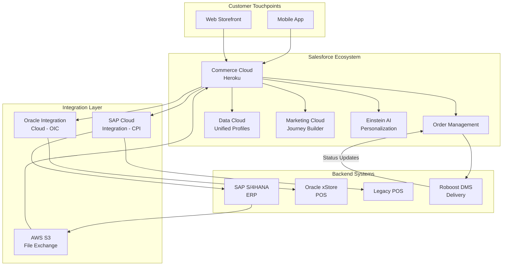

---

## 2. Core Pages & Components

### 2.1 Page Hierarchy

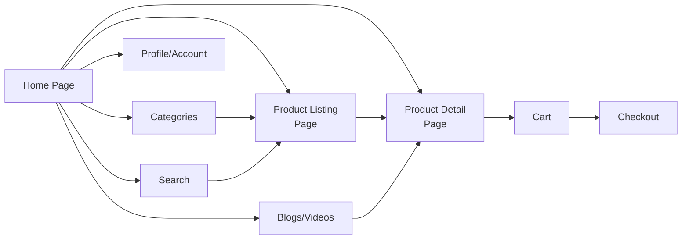

---

## 3. Home Page Requirements

### 3.1 Header Component

**Functional Requirements:**
- Render in expanded state on initial load; collapse on scroll down, expand on scroll up
- Delivery method selector: **Home Delivery** vs **Store Pickup** (affects pricing, availability, promotions globally)
- Dual search: barcode scanner + text input
- Notification icon with unread badge (conditional)
- Quick-access icons: Cart, Favourites/Wishlist, Profile/Account
- Order type selector: Prescription Upload vs Insurance Order
- Login-state awareness: guest vs authenticated user experience

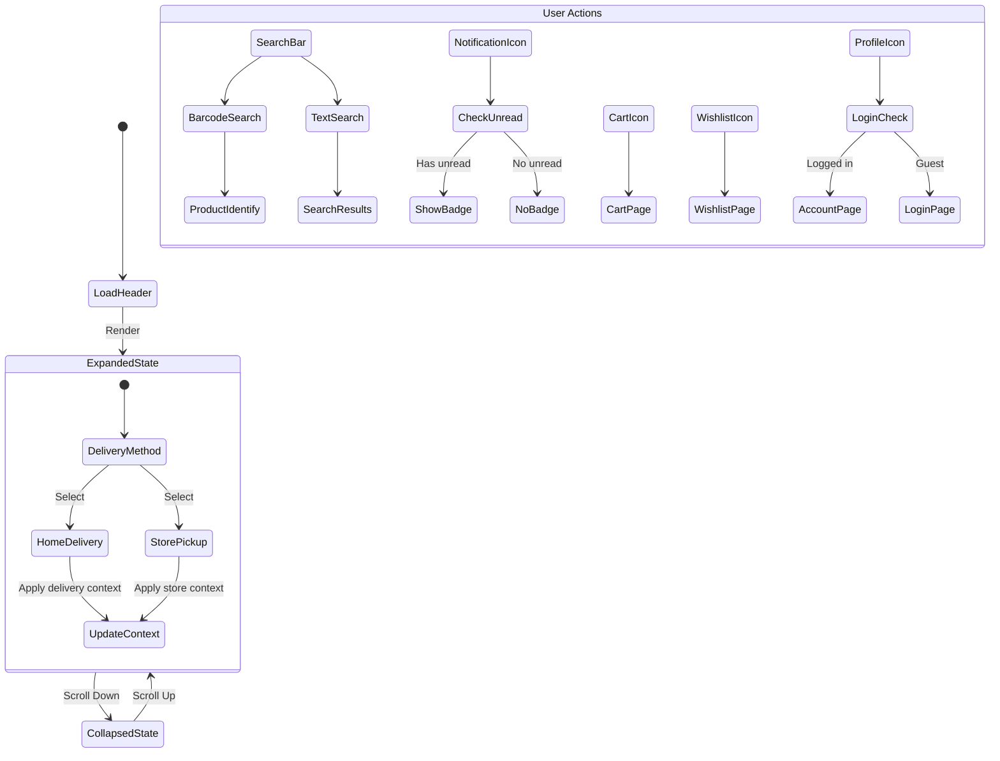

### 3.2 Categories Section

- Horizontal scroll rail with category thumbnails
- Optional hero category (larger size) configurable via CMS
- CMS-managed: category order, visibility, hero selection
- Analytics: impressions, clicks, performance tracking
- Tap navigates to Category PLP or curated landing page

### 3.3 Sections (CMS-Driven)

- Page Builder fetches and renders sections sequentially
- Component ordering: configured vs default fallback
- Each section has unified visual identity
- Supports personalization and merchandising rules
- Business team controls composition via Page Builder

### 3.4 Multi-Segment Carousel

- Personalization-aware segment selection
- Fallback to business rules when no personalization data
- Content types: products, brands, cards
- User interactions: tap segment links, swipe carousel
- CMS-managed segment definitions
- Analytics feedback loop into personalization engine

### 3.5 Video Component

- User-initiated playback (non-intrusive)
- Optional fullscreen mode
- Enabled/disabled via Page Builder
- Serves awareness and promotional content
- Engagement tracking for content optimization

### 3.6 Blogs/Videos Content Hub

- Category browsing with article/video listings
- Contextual commerce links within content (editorial-managed)
- Redirect to commerce pages from content
- Dual analytics: content engagement + commerce conversion
- SEO-optimized structure
- Error handling: network validation, loading error states

### 3.7 Bottom Navigation

- Fixed bottom bar with core navigation items
- Standard mobile app navigation pattern

---

## 4. Categories Page Requirements

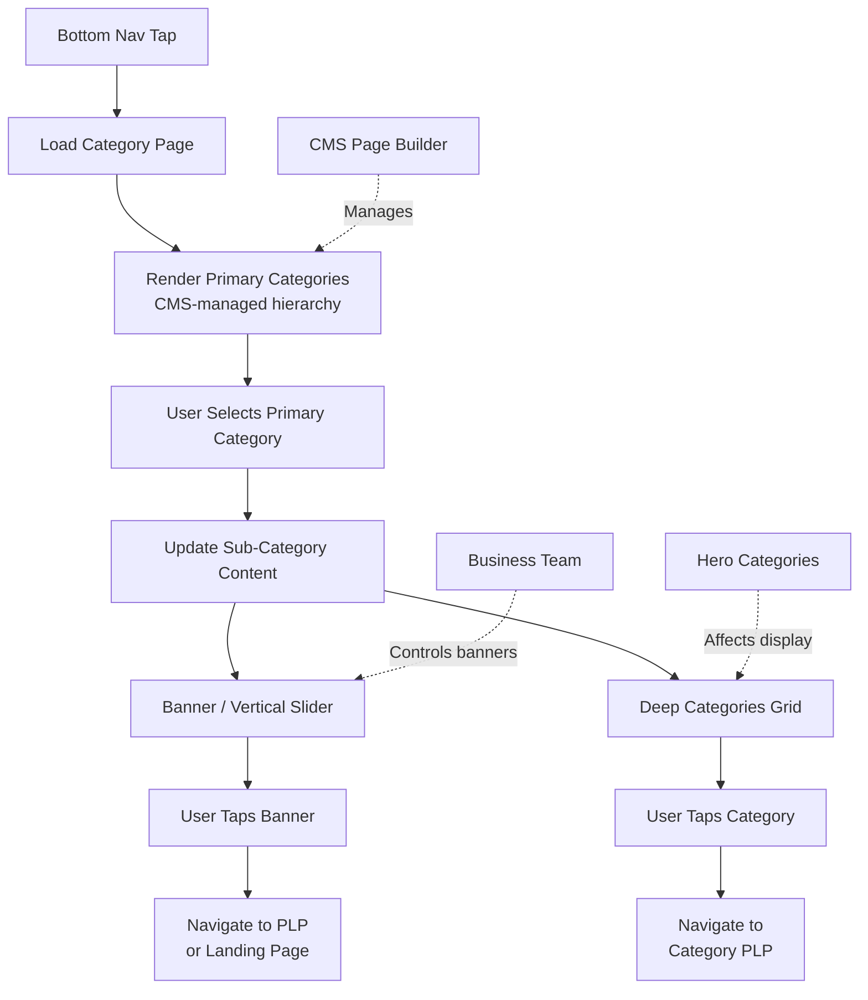

**Three-Tier Hierarchy:**
1. **Primary Categories** - Top-level (managed via CMS)
2. **Sub-Categories** - Display as banners/sliders or grids
3. **Deep Categories** - Grid layout, affected by hero category designation

---

## 5. Product Listing Page (PLP) Requirements

### 5.1 PLP Structure

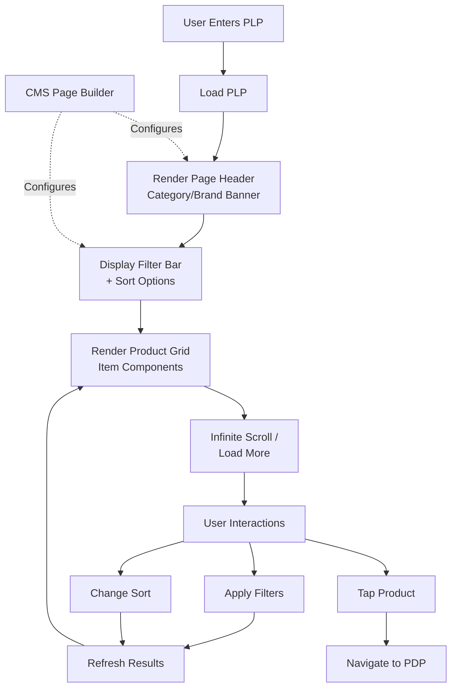

### 5.2 PLP CMS (Content Management)

- Built on **Salesforce CMS**
- Component library: Banner, Carousel, Grid, Video
- Approval workflow with role-based permissions
- Campaign scheduling with priority settings
- **Personalization engine**: targeting rules determine content
- A/B testing for continuous optimization
- Analytics tracking throughout

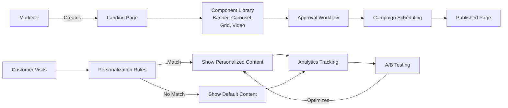

---

## 6. Item Component Requirements

The reusable product card component used across PLP, search results, carousels, and recommendations.

### 6.1 Rendering Logic

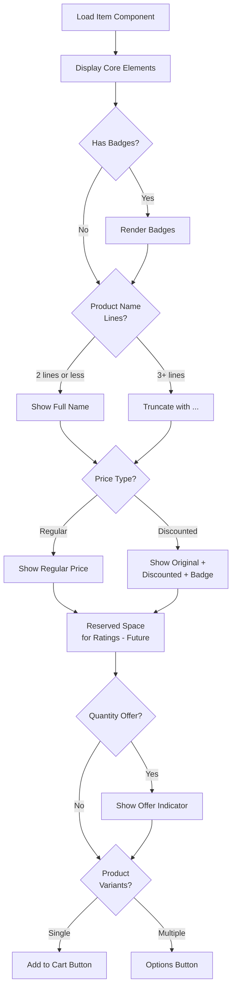

### 6.2 CTA Behavior Logic

| State | CTA Display | Action |
|-------|------------|--------|
| In Stock, Single Variant | "Add to Cart" | Direct add |
| In Stock, Multiple Variants | "Options" | Open variant selector |
| Out of Stock | "Notify Me" | Notification subscription |
| Prescription Required | "Upload RX" | Prescription upload flow |

### 6.3 Out of Stock Logic

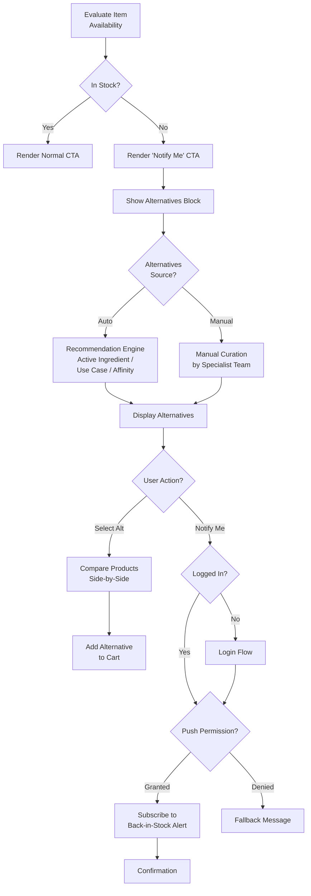

**Key Metrics Tracked:** OOS impressions, Notify Me subscriptions, alternative product conversions

---

## 7. Product Detail Page (PDP) Requirements

### 7.1 Page Structure (Top to Bottom)

```mermaid
graph TD
    subgraph "PDP Sections"
        A[1. Product Media Section<br/>Hero images/video + thumbnails]
        B[2. Product Title & Brand<br/>H1, brand, SKU, product ID]
        C[3. Price Block<br/>Original, current, discount badge, savings]
        D[4. Quantity Selector<br/>+/- controls, stock indicator]
        E[5. Primary CTA Button<br/>Add to Cart / Buy Now]
        F[6. Store Availability<br/>Zip code checker, local inventory]
        G[7. Product Description<br/>Key features, expandable content]
        H[8. Bundle Section<br/>Frequently Bought Together]
        I[9. Specs & Details<br/>Technical specs, accordion layout]
        J[10. Upsell Section<br/>Upgrade Your Choice]
        K[11. Cross-Sell Section<br/>Complete Your Purchase]
        L[12. Reviews Placeholder<br/>Future: ratings + review list]
    end

    A --> B --> C --> D --> E --> F --> G --> H --> I --> J --> K --> L
```

### 7.2 Purchase & CTA Logic

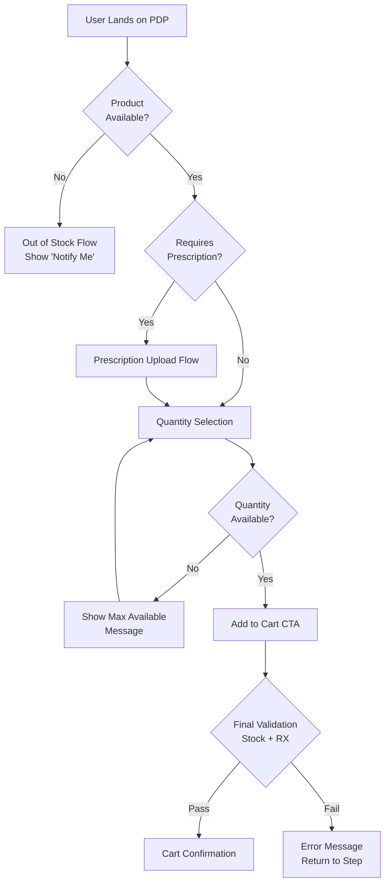

### 7.3 Sales Optimization Flow

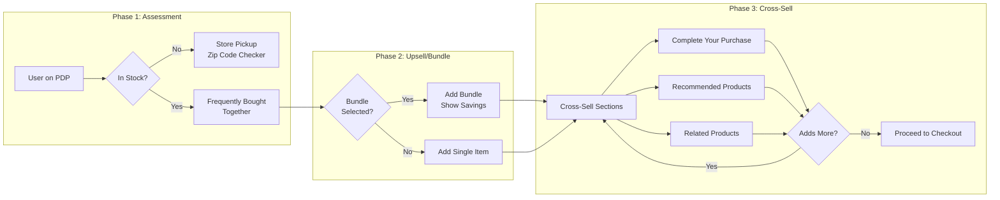

---

## 8. Search Requirements

### 8.1 Search Journey

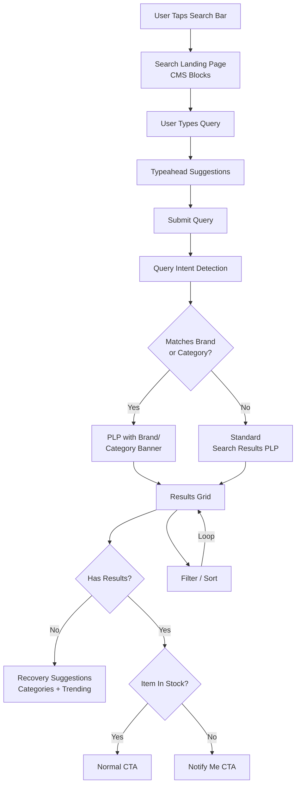

**Key Features:**
- CMS-configurable search landing page blocks
- Personalization influences suggestion ordering and result ranking
- Two rendering paths based on query intent (brand/category match)
- Graceful no-results recovery with alternative suggestions
- Out-of-stock items shown with "Notify Me" CTA
- Iterative refinement via filters/sort without page reload

---

## 9. User Registration & Onboarding

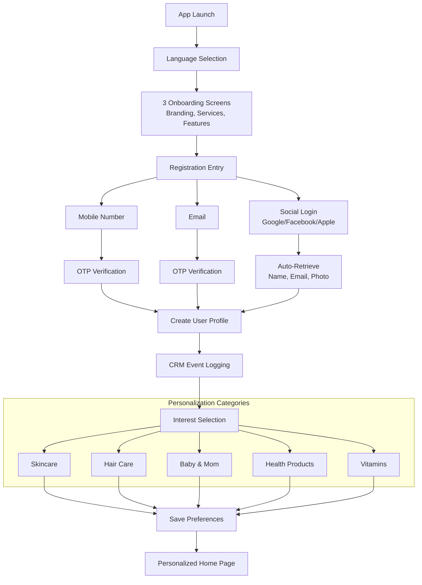

---

## 10. Backend Integration Requirements

### 10.1 Integration Data Flows

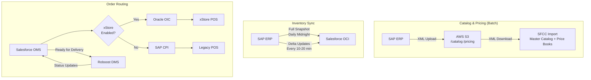

### 10.2 Order Fulfillment Flow

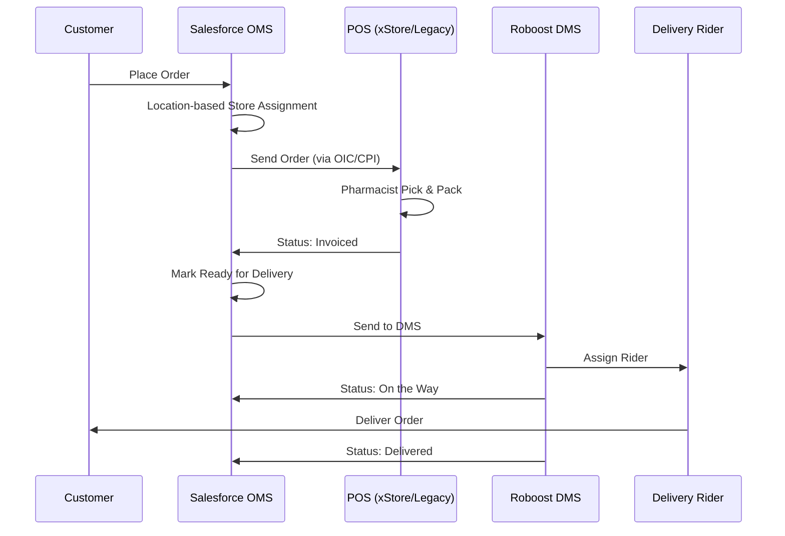

### 10.3 Inventory Safety Stock Logic

```
available_to_sell = stock_on_hand - safety_stock (min 0)

Example: SAP reports 2 units, safety_stock = 2
  -> available_to_sell = 0 -> Show "Out of Stock"

Fallback (OCI cache > 60 min):
  -> Freeze inventory to last known snapshot
  -> Limit qty to 1 for high-risk SKUs
  -> Display "Inventory updating - availability may vary"
```

---

## 11. Cross-Cutting Concerns

### 11.1 Personalization

| Touchpoint | Personalization Applied |
|-----------|----------------------|
| Home Page Sections | Section ordering, content selection |
| Multi-Segment Carousel | Default segment selection |
| Search Results | Suggestion ordering, result ranking |
| PLP | Product ranking, banner targeting |
| PDP | Bundle recommendations, cross-sell |
| Categories | Category ordering, hero selection |

### 11.2 CMS / Page Builder Control

All content-driven components are CMS-managed:
- Home page sections and component ordering
- Category hierarchy and hero designation
- PLP banners, filters, sorting options
- Search landing page blocks
- Video component visibility
- Blog/content hub management
- Campaign scheduling and A/B testing

### 11.3 Analytics Tracking

| Area | Metrics |
|------|---------|
| Search | Query patterns, typeahead engagement, conversion from search |
| Categories | Impressions, clicks, category performance |
| PLP | Filter usage, sort preferences, scroll depth |
| PDP | CTA clicks, bundle adoption, cross-sell conversion |
| OOS | Notify Me subscriptions, alternative conversions |
| Content | Engagement, commerce link clicks |
| Video | Play rate, completion rate, fullscreen usage |

---

## 12. Prototype Phasing Plan

### Phase 1: Core Shopping Experience (MVP)

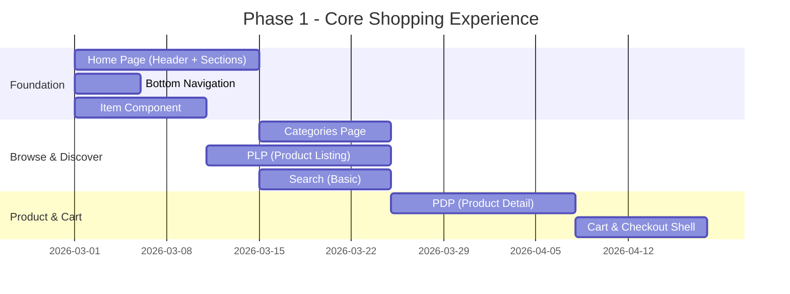

**Deliverables:**
- Functional home page with header, categories, sections
- Category browsing with 3-tier hierarchy
- PLP with filters, sorting, infinite scroll
- Reusable item component with all states
- PDP with full structure, CTA logic, bundles
- Basic search with typeahead and results
- Cart addition flow

### Phase 2: Engagement & Personalization

- Multi-segment carousel with personalization
- Search intent detection (brand/category matching)
- Out-of-stock flow (Notify Me, alternatives, comparison)
- Prescription upload flow
- Video component integration
- Blog/content hub with commerce links
- User registration and onboarding

### Phase 3: Backend Integration & Operations

- Salesforce Commerce Cloud setup
- SAP catalog/pricing sync (S3-based)
- Inventory sync (full snapshot + delta)
- Order routing (xStore vs Legacy POS)
- DMS integration for delivery
- Order fulfillment app (pharmacist workflow)
- Status normalization and tracking

### Phase 4: Optimization & Scale

- Einstein AI personalization engine
- A/B testing framework
- Marketing Cloud journeys
- Data Cloud unified profiles
- Advanced analytics and reporting
- Performance optimization

---

## 13. Technical Stack Recommendation

| Layer | Technology |
|-------|-----------|
| Frontend | React/Next.js (PWA) or React Native (Mobile) |
| Commerce Platform | Salesforce Commerce Cloud (SFCC) |
| CMS | Salesforce CMS + Page Builder |
| Personalization | Einstein AI |
| Search | SFCC Search + Typeahead |
| Order Management | Salesforce OMS |
| Integration | SAP CPI, Oracle OIC |
| File Exchange | AWS S3 |
| Inventory | Salesforce OCI |
| Delivery | Roboost DMS |
| Marketing | Salesforce Marketing Cloud |
| Analytics | Built-in SFCC + Custom Events |

---

## 14. Key Business Rules Summary

1. **Delivery method affects everything** - pricing, availability, promotions change based on Home Delivery vs Store Pickup
2. **Prescription products** require RX upload before cart addition
3. **Out-of-stock items** show "Notify Me" + alternatives (auto or curated)
4. **Quantity validation** occurs before cart addition to prevent overselling
5. **Safety stock** logic prevents selling below threshold
6. **Order routing** is conditional based on store's xStore capability
7. **Pharmacist** performs Pick & Pack in Salesforce Fulfillment App
8. **CMS controls content** - business teams operate without developer intervention
9. **Personalization** is additive - system degrades gracefully to business rules
10. **Guest browsing** supported but authentication required for cart/notifications

---

*Document generated from analysis of 8 Miro boards in the Elezaby-project team.*
*Boards analyzed: Home Page, Item Component, PLP, PDP, Search, Categories, User Journeys, El Ezaby <> 20Three*
